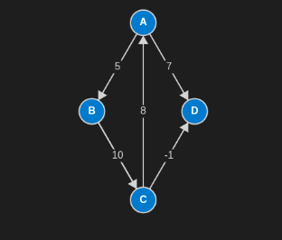
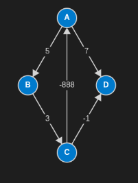

# Floyd-Warshall Algorithm

The Floyd-Warshall algorithm finds `the shortest paths` in a weighted graph with positive or negative edge weights (but `no negative cycles`). 

It is a dynamic programming algorithm that computes `the shortest paths between all pairs of vertices through intermediate vertices`.

## Idea



```text
Node1   Node2   Weight
A       B       5
B       C       3
A       D       7
C       D       -1
C       A       8
```

1. Given a weighted graph, represent it as an adjacency matrix `dist`.

```text
    A   B   C   D
A   0   5   ∞   7
B   ∞   0   3   ∞
C   8   ∞   0   -1
D   ∞   ∞   ∞   0
```

Where 
- `dist[i, j]` is the weight of the `edge` from `vertex` `i` to `vertex` `j`, if path exists;
- `0` if `i == j`;
- `INF` if no direct `edge` exists.


2. If there is an intermediate vertex `k = B` between vertices `A` and `C`, then the shortest path from `A` to `C` through `B` is the sum of the distances from `A` to `B` and from `B` to `C`.

```csharp
dist[A, C] = Math.Min(dist[A, C], dist[A, B] + dist[B, C]);
// Math.Min(∞, 5 + 3) = 8
```

```text
    A   B   C   D
A   0   5  [8]   7
B   ∞   0   3   ∞
C   8   ∞   0   -1
D   ∞   ∞   ∞   0
```

3. Calculate the shortest paths for all pairs of vertices `(i, j)` through an intermediate vertex `k = B`; 

```csharp
for each vertex i:
    for each vertex j:
        if (dist[i, k] != INF && dist[k, j] != INF) 
            dist[i, j] = Math.Min(dist[i, j], dist[i, k] + dist[k, j]);
```

4. Repeat for each intermediate vertex `k (k ∈ {A, B, C, D})` to calculate the shortest paths for all pairs `(i, j)`.

```csharp
for each vertex k:
    for each vertex i:
        for each vertex j:
            if (dist[i, k] != INF && dist[k, j] != INF) 
                dist[i, j] = Math.Min(dist[i, j], dist[i, k] + dist[k, j]);
```
## Complexity

- Time complexity: $O(V^3)$, where V is the number of vertices.
- Space complexity: $O(V^2)$, for storing the distance matrix.

## Example:
```csharp
const int INF = (int)1e+5;
var nodes = 4;
var dist = new int[,] {
    { 0, 5, INF, 7 },
    { INF, 0, 3, INF },
    { 8, INF, 0, -1 },
    { INF, INF, INF, 0 }
};

FloydWarshall(nodes, dist);
Print(nodes, dist);
//    0    5    8    7 
//   11    0    3    2 
//    8   13    0   -1 
//  INF  INF  INF    0 

void FloydWarshall(int nodes, int[,] dist)
{
    for (int k = 0; k < nodes; k++)
    {
        for (int i = 0; i < nodes; i++)
        {
            for (int j = 0; j < nodes; j++)
            {
                if (dist[i,k] != INF && dist[k,j] != INF) 
                { 
                    dist[i,j]=Math.Min(dist[i,j], dist[i,k] + dist[k,j]);
                }
            }
        }
    }
}

void Print(int nodes, int[,] dist)
{
    for (int i = 0; i < nodes; i++)
    {
        for (int j = 0; j < nodes; j++)
        {
            Console.Write($"{(dist[i,j] == INF? "INF" : dist[i,j]), 4} ");
        }
        Console.WriteLine();
    }
}
```

## Negative Cycle Detection

Floyd-Warshall can detect negative-weight cycles in $O(V^3)$ time. 

Initially, `dist[i, i] = 0` for all vertices. If a negative cycle exists that is reachable from vertex `i`, the algorithm will eventually relax `dist[i, i]` to a value less than `0`.


```text
Node1   Node2   Weight
A       B       5
B       C       3
A       D       7
C       D       -1
C       A       -888
```

```csharp
bool HasNegativeCycle(int nodes, int[,] dist)
{
    for (int i = 0; i < nodes; i++)
    {
        if (dist[i, i] < 0)
        {
            return true; 
        }
    }
    return false;
}
```

```csharp
const int INF = 1_000_000_000;
var nodes = 4;
var dist = new int[,] {
    { 0, 5, INF, 7 },
    { INF, 0, 3, INF },
    { -888, INF, 0, -1 },
    { INF, INF, INF, 0 }
};

FloydWarshall(nodes, dist);

if (HasNegativeCycle(nodes, dist))
{
    Console.WriteLine("Graph contains a negative weight cycle!");
}
Print(nodes, dist);


void FloydWarshall(int nodes, int[,] dist)
{
    for (int k = 0; k < nodes; k++)
    {
        for (int i = 0; i < nodes; i++)
        {
            for (int j = 0; j < nodes; j++)
            {
                if (dist[i, k] != INF && dist[k, j] != INF) 
                { 
                    dist[i, j] = Math.Min(dist[i, j], dist[i, k] + dist[k, j]);
                }
            }
        }
    }
}

bool HasNegativeCycle(int nodes, int[,] dist)
{
    for (int i = 0; i < nodes; i++)
    {
        if (dist[i, i] < 0)
        {
            return true;
        }
    }
    return false;
}

void Print(int nodes, int[,] dist)
{
    for (int i = 0; i < nodes; i++)
    {
        for (int j = 0; j < nodes; j++)
        {
            Console.Write($"{(dist[i,j] == INF? "INF" : dist[i,j]), 4} ");
        }
        Console.WriteLine();
    }
}
```