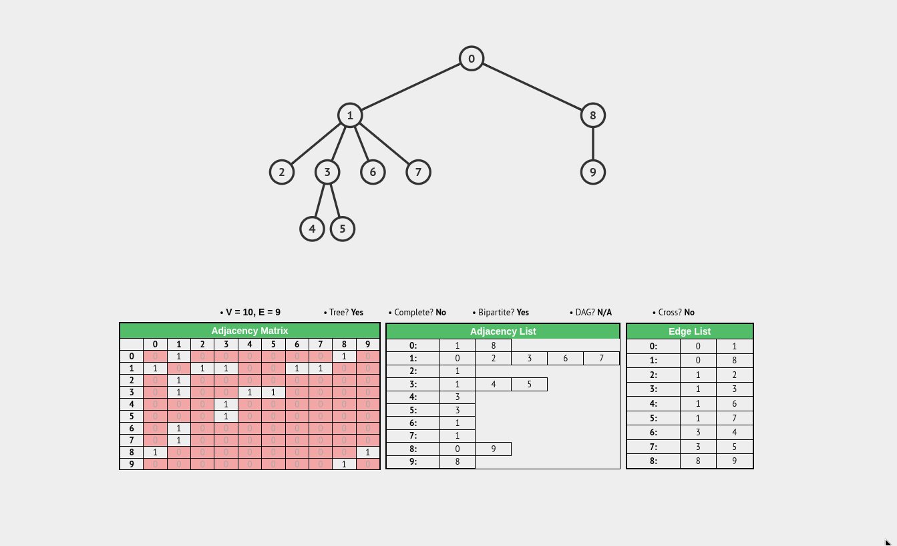
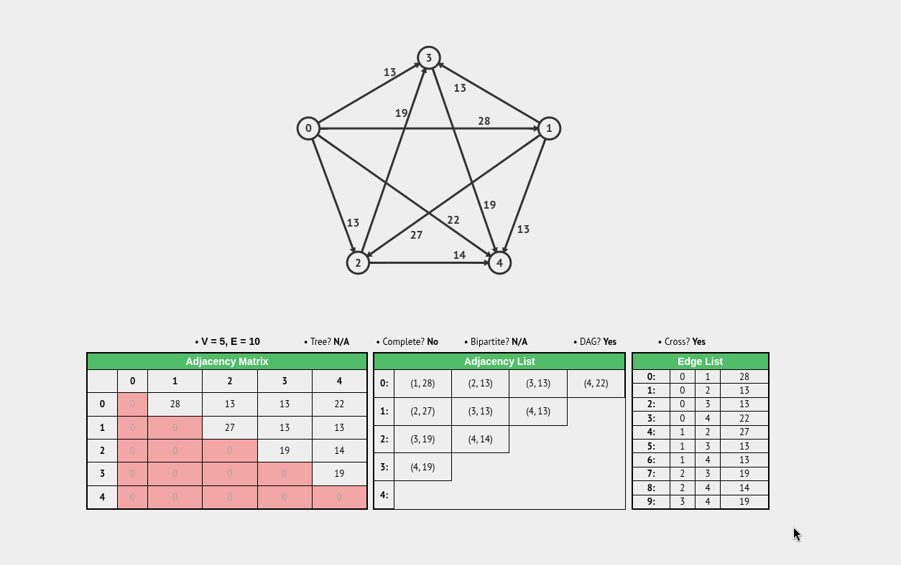

# Graph Representation

There are three ways to represent a graph in memory:
- Adjacency Matrix
- Adjacency List
- Adjacency Set

---

### 1. Adjacency Matrix

A 2D array (or grid) of size $V \times V$ where cells contain edge weights (or boolean values indicating presence).

**Pros:**
* **$O(1)$ Edge Lookup:** Checking whether an edge exists between vertex $u$ and $v$ takes constant time.
* **Edge Weight Access:** Excellent for dense graphs and algorithms that frequently query weights directly (e.g., Floyd-Warshall).
* **Simplicity:** Straightforward to implement using a standard 2D array or flattened memory block.

**Cons:**
* **High Memory Overhead:** Requires $O(V^2)$ space, which becomes extremely wasteful for sparse graphs where $E \ll V^2$.
* **Slow Neighbor Iteration:** Finding all neighbors of a vertex requires scanning an entire row of size $O(V)$, even if the vertex has only one connection.

---

### 2. Adjacency List

An array or hash map of vertices, where each vertex stores a collection (typically a linked list or dynamic array) of its adjacent neighbors.

**Pros:**
* **Space Efficient:** Requires $O(V + E)$ space, making it optimal for sparse graphs (which most real-world graphs are).
* **Fast Neighbor Traversal:** Iterating over the neighbors of a vertex takes $O(\text{degree}(v))$, which is proportional to the actual number of connections.

**Cons:**
* **Slow Edge Lookup:** Checking if a specific edge exists between $u$ and $v$ requires scanning the neighbor list of $u$, taking $O(\text{degree}(u))$ time.
* **Cache Locality Issues:** Depending on implementation (e.g., linked lists), node allocations can scatter across memory, leading to pointer chasing overhead.

---

### 3. Adjacency Set

Similar to an adjacency list, but each vertex stores its neighbors in a set (such as a Hash Set or Tree Set) instead of a sequential list.

**Pros:**
* **Fast Edge Lookup with Sparsity:** Retains the $O(V + E)$ space efficiency of adjacency lists while providing $O(1)$ average-time edge existence checks (if backed by a Hash Set).
* **Efficient Vertex Removal:** Deleting edges or vertices is faster because sets support $O(1)$ or $O(\log K)$ removal without needing to shift array elements or traverse entire lists.

**Cons:**
* **Higher Memory Overhead:** Hash sets or balanced trees consume more memory per vertex than simple dynamic arrays or linked lists due to load factor buffers and node overhead.
* **Overhead for Small Degrees:** For vertices with very few neighbors, the overhead of a set data structure outweighs its benefits compared to a simple list.

---

### Quick Comparison Summary

| Representation | Space Complexity | Edge Lookup | Neighbor Iteration | Best Used For |
| --- | --- | --- | --- | --- |
| **Matrix** | $O(V^2)$ | $O(1)$ | $O(V)$ | Dense graphs, frequent edge weight queries |
| **List** | $O(V + E)$ | $O(\text{degree}(v))$ | $O(\text{degree}(v))$ | Sparse graphs, frequent traversals (BFS/DFS) |
| **Set** | $O(V + E)$ | $O(1)$ (average) | $O(\text{degree}(v))$ | Sparse graphs requiring fast edge existence checks |
