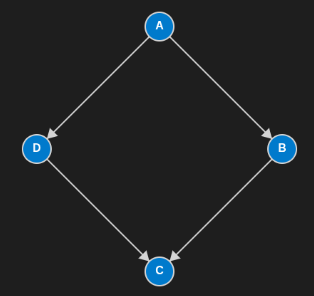
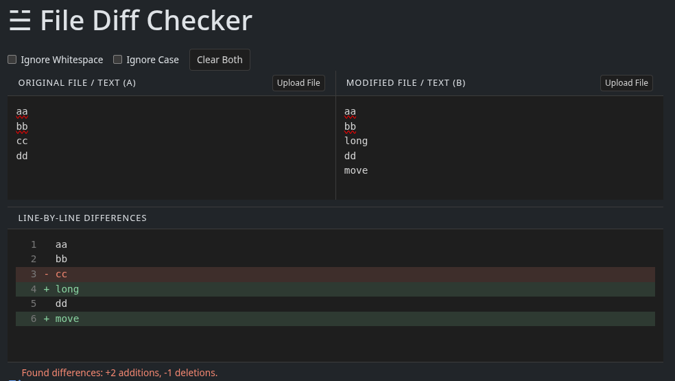

# Memoization vs. Tabulation

Memoization and tabulation are two fundamental techniques in dynamic programming used to optimize overlapping subproblem computations by storing intermediate results. `Memoization` is a `top-down` approach where results are cached on demand as recursive functions execute, while `tabulation` is a `bottom-up` approach that iteratively populates a table of results.

### Memoization

In memoization, we `store the results of expensive function calls and reuse them when the same inputs recur`. This technique eliminates redundant calculations and substantially improves the performance of recursive algorithms.

### Tabulation

Tabulation `involves solving subproblems iteratively and storing their results in a table (typically an array or matrix)`. This approach begins at the base cases and works upward to the target solution, ensuring each subproblem is evaluated exactly once.

## The Graph Connection

Every dynamic programming problem relies on two core elements:

* **States:** Each unique subproblem acts as a vertex (node) in a dependency graph.
* **Transitions:** Directed edges represent state dependencies (how one subproblem relies on or transitions to another).

Because subproblems must be resolved prior to the states that depend on them, these dependencies form a **Directed Acyclic Graph (DAG)**. Solving a dynamic programming problem is equivalent to finding a `shortest path`, `longest path`, or `counting paths` through this `DAG via depth-first search (DFS)` or `topological sorting`.



* **Memoization** uses `DFS with recursion`, starting at the target node and diving down to base cases, caching results along the way.
* **Tabulation** evaluates nodes in `topological order` (often implemented using nested loops or `BFS via Kahn's algorithm`).

## Example

### Longest Common Subsequence (LCS)
An `LCS (longest common subsequence)` is the longest subsequence shared across a set of sequences. 

LCS dynamic programming solutions can be viewed through graph theory as a `Directed Acyclic Graph (DAG) of overlapping subproblems`.

It can be computed efficiently using dynamic programming via `memoization` or `tabulation`.

An LCS is used to implement diff tools, compare file versions, and find similarities between sequences.




### Longest Common Subsequence (LCS) - Problem Description
> Given two strings `text1` and `text2`, return the `length of their longest common subsequence`. If there is no common subsequence, return 0.

> A subsequence of a string is a new string generated from the original string with some characters (can be none) deleted without changing the relative order of the remaining characters.

> For example, "ace" is a subsequence of "abcde".

> A common subsequence of two strings is a subsequence that is common to both strings.

> **Example 1:**

> Input: text1 = "abcde", text2 = "ace" 
> Output: 3  
> Explanation: The longest common subsequence is "ace" and its length is 3.

> **Example 2:**

> Input: text1 = "abc", text2 = "abc"
> Output: 3
> Explanation: The longest common subsequence is "abc" and its length is 3.

> **Example 3:**

> Input: text1 = "abc", text2 = "def"
> Output: 0
> Explanation: There is no such common subsequence, so the result is 0.

> **Constraints:**

> 1 <= text1.length, text2.length <= 1000
> text1 and text2 consist of only lowercase English characters.


## Graph Representation of LCS States

Two strings can be represented as a graph where:

* **Nodes:** Each node corresponds to a state $(i, j)$, representing the current positions in `text1` and `text2`.
* **Directed Edges:** Transitions flow from state $(i, j)$ based on character matching:
* If $A[i] == B[j]$: An edge leads from $(i, j)$ to $(i+1, j+1)$, representing a match.
* Otherwise: Two branching edges lead from $(i, j)$ to $(i+1, j)$ and $(i, j+1)$, representing deletions from either string.

### Memoization Approach

It performs a lazy, demand-driven traversal with `DFS`. It only visits nodes and subproblems that are strictly reachable from the initial call.

```csharp
public class Solution {
    public int LongestCommonSubsequence(string text1, string text2) {
        var memo = new int?[text1.Length, text2.Length];

        return DFS(text1, text2, 0, 0, memo);
    }

    public int DFS(string text1, string text2, int i, int j, int?[,] memo) {
        if (i >= text1.Length || j >= text2.Length) {
            return 0;
        }
        if (memo[i, j].HasValue) {
            return memo[i, j].Value;
        }

        int result;

        // Transitioning to the next state(node) based on character match or skip
        if (text1[i] == text2[j]) {
            // Branch: both are equal
            result = 1 + DFS(text1, text2, i + 1, j + 1, memo);
        } else {
            // Branch: skips one character from either string
            result = Math.Max(
                DFS(text1, text2, i + 1, j, memo),
                DFS(text1, text2, i, j + 1, memo)
            );
        }

        memo[i, j] = result;
        return result;
    }
}
```

### Tabulation Approach

Tabulation approaches the graph iteratively, filling the grid from the base cases $(0, 0)$ up to $(rows, cols)$ in topological order. It evaluates every single node in the $rows \times cols$ grid systematically, regardless of whether a specific subproblem is strictly necessary for the final path.

#### 2D Tabulation Implementation
```csharp
public class Solution
{
    public int LongestCommonSubsequence(string text1, string text2)
    {
        var rows = text1.Length;
        var cols = text2.Length;
        var table = new int[rows + 1, cols + 1];

        for (int i = 1; i <= rows; i++)
        {
            for (int j = 1; j <= cols; j++)
            {
                if (text1[i - 1] == text2[j - 1])
                {
                    // Branch: both are equal
                    table[i, j] = 1 + table[i - 1, j - 1];
                }
                else
                {
                    // Branch: skips one character from either string
                    table[i, j] = Math.Max(
                        table[i, j - 1],
                        table[i - 1, j]
                    );
                }
            }
        }

        return table[rows, cols];
    }
}
```

#### 1D Tabulation Implementation

In the 2D version, computing table[i, j] relies on only three values:
- table[i - 1, j - 1] (The diagonal element: results without both characters)
- table[i - 1, j] (The top element: results from the previous row at the same column)
- table[i, j - 1] (The left element: results from the current row at the previous column)

Because row $i$ never looks back at rows except the previous one, storing the entire 2D table wastes memory. A single 1D array of size $cols + 1$ can represent the "previous row" and be updated in place for the "current row."


```csharp
public class Solution
{
    public int LongestCommonSubsequence(string text1, string text2)
    {
        var rows = text1.Length;
        var cols = text2.Length;
        var table = new int[cols + 1];

        for (int i = 1; i <= rows; i++)
        {
            int previous = 0;
            for (int j = 1; j <= cols; j++)
            {
                var tmp = table[j];
                if (text1[i - 1] == text2[j - 1])
                {
                    // Branch: both are equal
                    table[j] = 1 + previous;
                }
                else
                {
                    // Branch: skips one character from either string
                    table[j] = Math.Max(table[j], table[j - 1]);
                }
                previous = tmp;
            }
        }

        return table[cols];
    }
}
```

* table[j] holds the value from the previous row (table[i - 1, j]). This replaces the need for the "top" value.