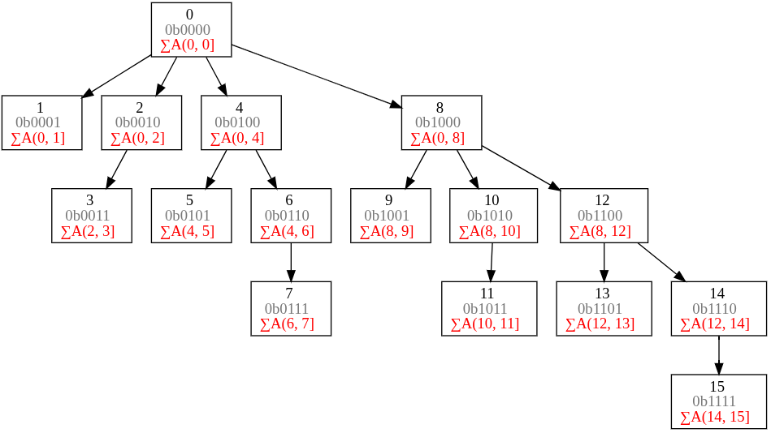
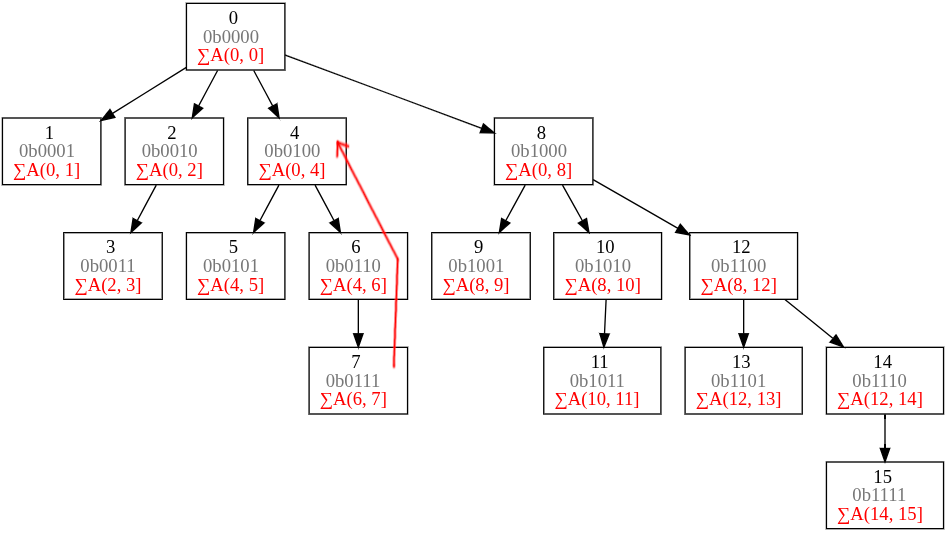

# Fenwick Tree



## LBS (Least Significant Bit) two core functions

LBS it is the last set bit of a number. 
```text
DEC    BIN     LBS
0      0000     -
1      0001    0001
2      0010    0010
3      0011    0001
4      0100    0100
5      0101    0001
6      0110    0010
7      0111    0001
8      1000    1000
9      1001    0001
10     1010    0010
11     1011    0001
12     1100    0100
13     1101    0001
14     1110    0010
15     1111    0001
```
It can be calculated using the expression:
```text
LBS(i) = i & -i
```
For example:
```text
LBS(6) = 6 & -6 = 2  (binary `0110` & `1010` = `0010`)
LBS(8) = 8 & -8 = 8  (binary `1000` & `1000` = `1000`)
```
* To convert positive number $i$ to its negative counterpart: 
1. Flip all the bits of $i$ (bitwise NOT operation).
2. Add $1$ to the result.
```
6:  0110
-6: 1001+1 = 1010
```


### 1. Defining the Range of Sums (Responsibility)

Each node at index $i$ is responsible for storing the sum of an interval of length equal to its lowest set bit ($\text{LSB}(i)$).

Specifically, the node at index $i$ covers the range:

$$\left[i - \text{LSB}(i) + 1, \; i\right]$$

* **Index $6$** (binary `0110`): $\text{LSB}(6) = 2$ (`0010`). It stores the sum of $2$ elements ending at index $6$—meaning elements in the range $[5, 6]$.
* **Index $8$** (binary `1000`): $\text{LSB}(8) = 8$ (`1000`). It stores the sum of $8$ elements ending at index $8$—meaning elements in the range $[1, 8]$.


```pre                                     ___
                                  _________
                                  ______
                            ______
                       ______________
                       _________ 
                       _____
                 ______
           _________ 
           ______
     _______
   _______________________
   ____________
   ______    
   ___
  
 +--+--+--+--+--+--+--+--+--+--+--+--+--+--+--+
 0  1  2  3  4  5  6  7  8  9 10 11 12 13 14 15
```

---

### 2. Navigating the Tree (Updates and Queries)

The LSB acts as a step vector to move between parent and child relationships depending on whether you are **updating** a value or **querying** a prefix sum:

#### Updating a Value

Parent Node is calculated by expression:
```text
parent(i) = i + (i & -i)
```

For example, to find the parent of index $6$:
```text
parent(6) = 6 + (6 & -6) = 6 + 2 = 8
```

Indexes of parent nodes create a tree:

nums:       [...]

`indexes of parent nodes`: [1, 2, 3, 4, 5, 6, 7, 8, 9, 10, 11, 12, 13, 14, 15, 16]

```text

                 16
          ┌──────┼──────┐
          8      12     14
       ┌──┼──┐  ┌┴─┐   ┌┴─┐
       4  6  7  10 11  13 15
      ┌┴┐ └┐
      2 3  5
      │
      1
```
Note: for array with 15 elements (1-indexed), the tree will not have root at index 16, as the highest index is 15.

#### Querying a Prefix Sum



Sum of `7` = `nums[7] + nums[6] + nums[4]`

## C# Implementation of Fenwick Tree

```csharp
var numArray = new NumArray([1, 2, 3, 4, 5]);

Console.WriteLine("Tree before update: " + string.Join(", ", numArray.Tree));

numArray.Update(2, 10);
var sum = numArray.SumRange(1, 3);

Console.WriteLine("Sum after update: " + sum); 
Console.WriteLine("Tree after update: " + string.Join(", ", numArray.Tree)); 


// Tree before update: 0, 1, 3, 3, 10, 5
// Sum after update: 16
// Tree after update: 0, 1, 3, 10, 17, 5

public class NumArray
{
    int[] nums;
    int[] tree;
    public NumArray(int[] nums)
    {
        this.nums = nums;
        this.tree = new int[nums.Length + 1];
        for (int i = 1; i <= nums.Length; i++)
        {
            this.tree[i] = this.nums[i - 1];
        }

        for (int i = 1; i <= nums.Length; i++)
        {
            var parent = i + (i & -i);
            if (parent < this.tree.Length)
            {
                this.tree[parent] += this.tree[i];
            }
        }
    }

    public int[] Tree => tree;

    public void Update(int index, int val)
    {
        var diff = val - this.nums[index];
        this.nums[index] = val;

        index++;

        // update all parents
        while (index < this.tree.Length)
        {
            this.tree[index] += diff;
            index += index & -index;
        }
    }

    public int SumRange(int left, int right)
    {
        right++;
        left++;
        return PrefixSum(right) - PrefixSum(left - 1);
    }

    private int PrefixSum(int index)
    {
        var sum = 0;

        while (index > 0)
        {
            sum += this.tree[index];
            index -= index & -index;
        }
        return sum;
    }
}

```

## Fenwick Tree vs Segment Tree
| Feature | Fenwick Tree | Segment Tree |
|---------|--------------|--------------|
| Build   | O(n log n)   | O(n)         |
| Update  | O(log n)     | O(log n)     |
| Query   | O(log n)     | O(log n)     |
| Space   | O(n)         | O(4n)        |

`Fenwick Tree` is generally more space-efficient than `Segment Tree`, but `Segment Tree` is more versatile and can handle a wider range of queries.