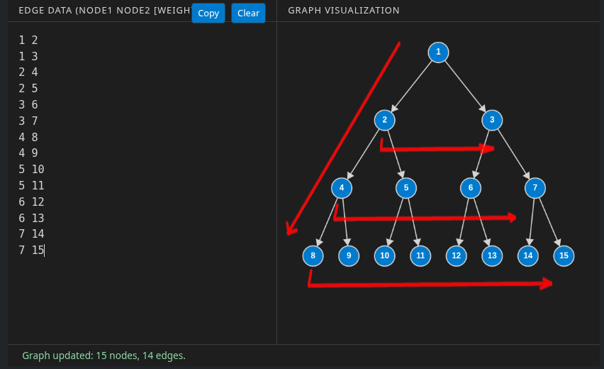

# Segment Tree



<details>
<summary>Segment Tree Structure</summary>
```pre
1 2
1 3
2 4
2 5
3 6
3 7
4 8
4 9
5 10
5 11
6 12
6 13
7 14
7 15
```
</details>

<br>

The array `1, 2, 3, 4, 5` in the segment tree is represented as follows:

`15, 6, 9, 3, 3, 4, 5, 1, 2, 0, 0, 0, 0, 0, 0, 0, 0, 0, 0, 0`

```csharp
var numArray = new NumArray([1, 2, 3, 4, 5]);

Console.WriteLine("Tree before update: " + string.Join(", ", numArray.Tree));

numArray.Update(2, 10);
var sum = numArray.SumRange(1, 3);

Console.WriteLine("Sum after update: " + sum); 
Console.WriteLine("Tree after update: " + string.Join(", ", numArray.Tree)); 

// Tree before update: 15, 6, 9, 3, 3, 4, 5, 1, 2, 0, 0, 0, 0, 0, 0, 0, 0, 0, 0, 0
// Sum after update: 16
// Tree after update: 22, 13, 9, 3, 10, 4, 5, 1, 2, 0, 0, 0, 0, 0, 0, 0, 0, 0, 0, 0

public class NumArray
{
    private readonly int[] nums;
    private readonly int[] tree;

    public NumArray(int[] nums)
    {
        this.nums = nums;
        this.tree = new int[nums.Length * 4];
        BuidTree(0, nums.Length - 1, 0);
    }
    
    public int[] Tree => tree;

    public void Update(int index, int val)
    {
        var diff = val - this.nums[index];
        UpdateTree(0, this.nums.Length - 1, 0, index, diff);
        this.nums[index] = val;
    }

    public int SumRange(int left, int right)
    {
        return SumRangeInTree(0, nums.Length - 1, 0, left, right);
    }

    private int SumRangeInTree(int start, int end, int i, int left, int right)
    {
        if (right < start || end < left)
        {
            return 0;
        }

        if (start >= left && end <= right)
        {
            return tree[i];
        }

        var mid = start + (end - start) / 2;
        var leftNode = 2 * i + 1;
        var rightNode = 2 * i + 2;


        return SumRangeInTree(start, mid, leftNode, left, right)
             + SumRangeInTree(mid + 1, end, rightNode, left, right);
        ;
    }


    private void UpdateTree(int start, int end, int i, int index, int diff)
    {
        if (end == start)
        {
            tree[i] += diff;
            return;
        }
        var mid = start + (end - start) / 2;
        var leftNode = 2 * i + 1;
        var rightNode = 2 * i + 2;
        if (index <= mid)
        {
            UpdateTree(start, mid, leftNode, index, diff);
        }
        else
        {
            UpdateTree(mid + 1, end, rightNode, index, diff);
        }

        tree[i] += diff;
    }

    private void BuidTree(int start, int end, int i)
    {
        if (end == start)
        {
            tree[i] = this.nums[start];
            return;
        }
        var mid = start + (end - start) / 2;
        var leftNode = 2 * i + 1;
        var rightNode = 2 * i + 2;
        BuidTree(start, mid, leftNode);
        BuidTree(mid + 1, end, rightNode);

        tree[i] = tree[leftNode] + tree[rightNode];
    }
}
```