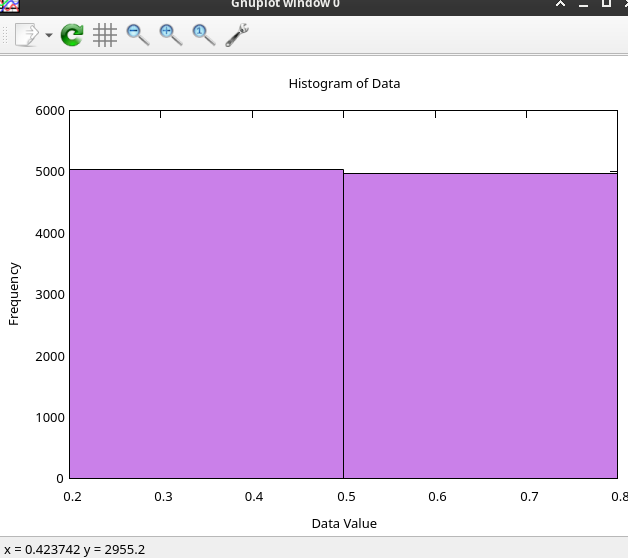
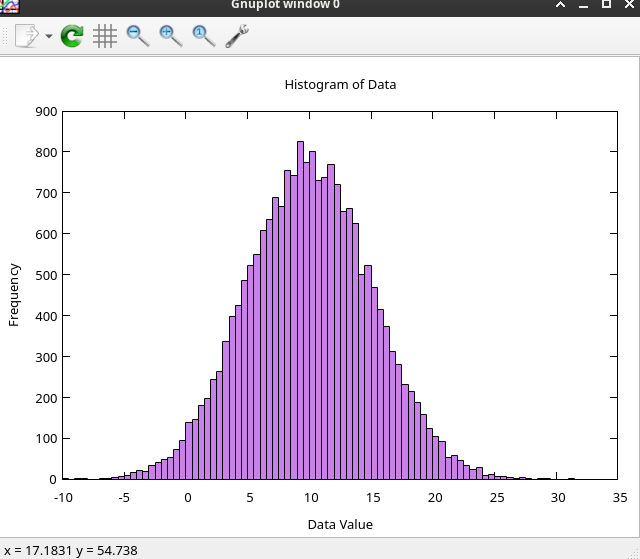
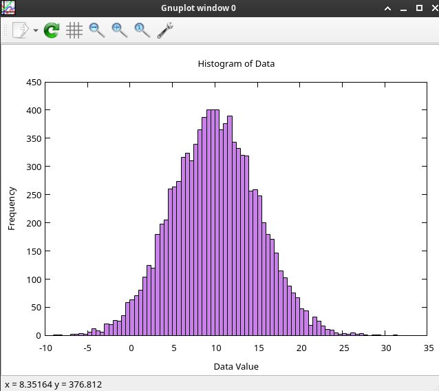

# Box–Muller transform

`The Box–Muller transform` is a random number sampling method for generating pairs of independent, standard, `normally distributed` (zero expectation, unit variance) random numbers, given a source of `uniformly distributed` random numbers. 

https://en.wikipedia.org/wiki/Box–Muller_transform

## `uniformly distributed` random numbers: 

```csharp
Random rand = new(123);

var path = "data.dat";
File.WriteAllText(path, string.Empty);
for (int i = 0; i < 10_000; i++)
{
    await File.AppendAllTextAsync(path, $"{rand.NextDouble()}{Environment.NewLine}");
}
```


## `normally distributed` random numbers:

```csharp
Random rand = new(123);

var path = "data.dat";
File.WriteAllText(path, string.Empty);
for (int i = 0; i < 10_000; i++)
{
    var (z0, z1) = BoxMullerTransform(10, 5, rand);
    await File.AppendAllTextAsync(path, $"{z0}{Environment.NewLine}");
    await File.AppendAllTextAsync(path, $"{z1}{Environment.NewLine}");
}

/// <summary>
/// Box-Muller Transform to get a Normal Distribution
/// https://en.wikipedia.org/wiki/Box–Muller_transform
/// </summary>
public static (double z0, double z1) BoxMullerTransform(double mean, double deviation, Random rand) 
{
    double u1 = rand.NextDouble(); 
    double u2 = rand.NextDouble();

    double part1 = Math.Sqrt(-2.0 * Math.Log(u1));
    double part2 = 2.0 * Math.PI * u2;
        
    double z0 = part1 * Math.Cos(part2);
    double z1 = part1 * Math.Sin(part2);

    return (z0 * deviation + mean, z1 * deviation + mean);
}

```


## `normally distributed` random numbers (only z0):

```csharp
Random rand = new(123);

var path = "data.dat";
File.WriteAllText(path, string.Empty);
for (int i = 0; i < 10_000; i++)
{
    var (z0, z1) = BoxMullerTransform(10, 5, rand);
    await File.AppendAllTextAsync(path, $"{z0}{Environment.NewLine}");
    // await File.AppendAllTextAsync(path, $"{z1}{Environment.NewLine}");
}

```



### Helper `gnuplot` script to build histogram with numbers distribution

`file.gp`
```sh
# Define bin width and a binning function
bin_width = 0.5
bin(x, width) = width * floor(x / width) + width / 2.0

# Configure the plot appearance
set style fill solid 0.5 border -1
set boxwidth bin_width absolute
set xlabel "Data Value"
set ylabel "Frequency"
set title "Histogram of Data"

# Plot the data using smooth frequency
plot 'data.dat' using (bin($1, bin_width)):(1.0) smooth frequency with boxes notitle
```

```sh
$ gnuplot file.gp -p
```