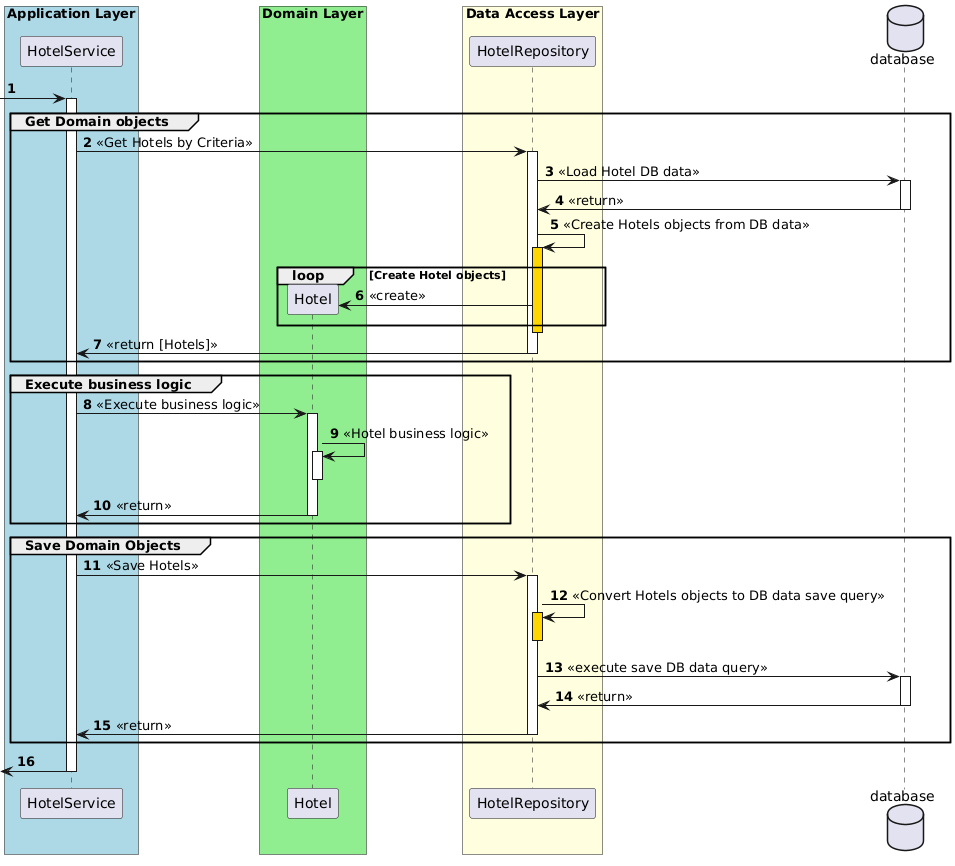
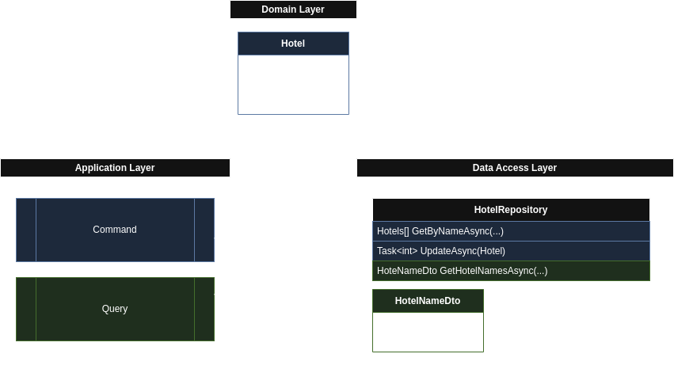

# Repository

The `Repository` pattern is a `Gateway` pattern that abstracts `data access logic`. It enables inner layers, such as the `Application Layer` in `Clean Architecture`, to access `domain objects` through a `collection-like interface`.

The `Application Layer` can add a `domain object` to the `Repository` or load `domain objects` based on specific `criteria`. The `Repository` pattern hides database interactions behind the scenes.

The `Repository pattern` is very similar to the `Data Access Object` (DAO) pattern, except that it operates exclusively with `Domain Models`.

## Example
<hidden style="display:none">
@startuml
autonumber
box "Application Layer" #LightBlue
participant HotelService
end box
box "Domain Layer" #LightGreen
participant Hotel
end box
box "Data Access Layer" #LightYellow
participant HotelRepository
end box
database database

[->HotelService ++

group Get Domain objects 
 HotelService -> HotelRepository ++ : <<Get Hotels by Criteria>>
 HotelRepository -> database ++ : <<Load Hotel DB data>>
 HotelRepository <- database -- : <<return>>
 HotelRepository -> HotelRepository ++ #gold: <<Create Hotels objects from DB data>>
 loop Create Hotel objects
  HotelRepository -> Hotel ** : <<create>>
 end
 deactivate HotelRepository
 HotelService <- HotelRepository -- : <<return [Hotels]>>
 deactivate HotelRepository
end

group Execute business logic 
 HotelService -> Hotel ++ : <<Execute business logic>>
 Hotel -> Hotel ++-- : <<Hotel business logic>>
 HotelService <- Hotel -- : <<return>>
end 

group Save Domain Objects 
 HotelService -> HotelRepository ++ : <<Save Hotels>>
 HotelRepository -> HotelRepository ++ #gold: <<Convert Hotels objects to DB data save query>>
 deactivate HotelRepository
 HotelRepository -> database ++ : <<execute save DB data query>>
 HotelRepository <- database -- : <<return>>
 HotelService <- HotelRepository -- : <<return>>
end


deactivate HotelRepository

[<-HotelService
deactivate HotelService

deactivate database
@enduml
</hidden>




```csharp

namespace ApplicationLayer {
    using DomainLayer;
    public class HotelService(IHotelRepository hotelRepository)
    {
        public async Task ChangeHotelsNameAsync(string name, string newName)
        {
            // Get Domain objects
            var hotels = await hotelRepository.GetByNameAsync(name);

            // Execute Domain logic
            foreach (var hotel in hotels)
            {
                hotel.ChangeName(newName);
            }

            // Save Domain objects
            foreach (var hotel in hotels)
            {
                await hotelRepository.UpdateAsync(hotel);
            }
        }
    }
}

namespace DomainLayer
{
    public class Hotel
    {
        public int Id { get; set; }

        public string Name { get; set; }

        public string Address { get; set; }

        public decimal PricePerNight { get; set; }

        public int Stars { get; set; }

        public void ChangeName(string name)
        {
            if (string.IsNullOrWhiteSpace(name))
            {
                throw new ArgumentException("Name cannot be empty");
            }

            Name = name;
        }
    }

    public interface IHotelRepository
    {
        Task<IEnumerable<Hotel>> GetAllAsync();

        Task<IEnumerable<Hotel>> GetByNameAsync(string name);

        Task<IEnumerable<Hotel>> GetHotelsByPriceRangeAsync(decimal minPrice, decimal maxPrice);

        Task<Hotel?> TryGetByIdAsync(int id);

        Task<int> AddAsync(Hotel hotel);

        Task<int> UpdateAsync(Hotel hotel);

        Task<int> DeleteAsync(int id);
    }
}

namespace DataAccessLayer
{
    using Dapper;
    using DomainLayer;
    using System.Collections.Generic;
    using System.Data;
    using System.Threading.Tasks;


    public class HotelRepository(IDbConnection connection) : IHotelRepository
    {
        public async Task<IEnumerable<Hotel>> GetAllAsync()
        {
            const string sql = "SELECT Id, Name, Address, PricePerNight, Stars FROM Hotels";

            using var multi = await connection.QueryMultipleAsync(sql);

            return multi.Read<Hotel>();
        }
        public async Task<IEnumerable<Hotel>> GetByNameAsync(string name)
        {
            const string sql = "SELECT Id, Name, Address, PricePerNight, Stars FROM Hotels WHERE Name LIKE @Name";

            return await connection.QueryAsync<Hotel>(sql, new { Name = name });
        }

        public async Task<IEnumerable<Hotel>> GetHotelsByPriceRangeAsync(decimal minPrice, decimal maxPrice)
        {
            const string sql = @"
            SELECT Id, Name, Address, PricePerNight, Stars 
            FROM Hotels 
            WHERE PricePerNight >= @MinPrice AND PricePerNight <= @MaxPrice";

            return await connection.QueryAsync<Hotel>(sql, new { MinPrice = minPrice, MaxPrice = maxPrice });
        }

        public async Task<Hotel?> TryGetByIdAsync(int id)
        {
            const string sql = "SELECT Id, Name, Address, PricePerNight, Stars FROM Hotels WHERE Id = @Id";

            return await connection.QueryFirstOrDefaultAsync<Hotel>(sql, new { Id = id });
        }

        public async Task<int> AddAsync(Hotel hotel)
        {
            const string sql = @"
            INSERT INTO Hotels (Name, Address, PricePerNight, Stars) 
            VALUES (@Name, @Address, @PricePerNight, @Stars);
            SELECT CAST(SCOPE_IDENTITY() as int)";

            return await connection.QuerySingleAsync<int>(sql, hotel);
        }

        public async Task<int> UpdateAsync(Hotel hotel)
        {
            const string sql = @"
            UPDATE Hotels 
            SET Name = @Name, Address = @Address, PricePerNight = @PricePerNight, Stars = @Stars 
            WHERE Id = @Id";

            return await connection.ExecuteAsync(sql, hotel);
        }

        public async Task<int> DeleteAsync(int id)
        {
            const string sql = "DELETE FROM Hotels WHERE Id = @Id";

            return await connection.ExecuteAsync(sql, new { Id = id });
        }
    }

}

```


## DataMapper + Repository

The `Data Mapper pattern` can significantly simplify the implementation of the `Repository pattern`.

 Instead of handling the intricate details of mapping data between `database rows` and `domain objects` within the `Repository`, the `Data Mapper` takes on this responsibility.<br> 
 This makes the `Repository's` methods cleaner, more focused on business logic, and easier to understand.

 On the other hand, without a `Data Mapper`, the `Repository` can utilize `stored procedures` to improve performance.

 * `EF Core` `DbContext` by itself implements both the `Repository` and the `Unit of Work` patterns. Custom implementation of `Repository` might be *redundant*.


```csharp

namespace ApplicationLayer {
    using DomainLayer;
    public class HotelService(IHotelRepository hotelRepository)
    {
        public async Task ChangeHotelsNameAsync(string name, string newName)
        {
            // Get Domain objects using EF Core
            var hotels = await hotelRepository.GetByNameAsync(name);

            // Execute Domain logic
            foreach (var hotel in hotels)
            {
                hotel.ChangeName(newName);
            }

            // Saves Domain objects
            foreach (var hotel in hotels)
            {
                await hotelRepository.UpdateAsync(hotel);
            }
        }
    }
}

namespace DataAccessLayer
{
    using Dapper;
    using DomainLayer;
    using Microsoft.EntityFrameworkCore;
    using System.Collections.Generic;
    using System.Data;
    using System.Threading.Tasks;


    public class HotelRepository(HotelDbContext context) : IHotelRepository
    {
        public async Task<IEnumerable<Hotel>> GetByNameAsync(string name)
        {
            return await context.Hotels.Where(h => h.Name.Contains(name)).ToListAsync();
        }

        public async Task<IEnumerable<Hotel>> GetHotelsByPriceRangeAsync(decimal minPrice, decimal maxPrice)
        {
            return await context.Hotels.Where(h => h.PricePerNight >= minPrice && h.PricePerNight <= maxPrice).ToListAsync();
        }

        public async Task<int> UpdateAsync(Hotel hotel)
        {
            context.Hotels.Update(hotel);

            return await context.SaveChangesAsync();
        }
    }

    public class HotelDbContext : DbContext
    {
        public HotelDbContext(DbContextOptions<HotelDbContext> options) : base(options) { }

        public DbSet<Hotel> Hotels { get; set; }
    }
}

```


## Repository Criteria

Each Repository method accepts Criteria that guide the execution of database operations.<br>
Criteria are the set of conditions or specifications used to filter or query data within the repository.

Criteria can be implemented in various ways, depending on the specific needs and complexity of the application.

### Criteria: Simple properties

For basic filtering, can be used `simple` properties or `parameters` in the repository methods.
```csharp
public interface IHotelRepository
{
    Task<IEnumerable<Hotel>> GetByNameAsync(string name);

    Task<IEnumerable<Hotel>> GetHotelsByPriceRangeAsync(decimal minPrice, decimal maxPrice);
}
```
### Criteria: Expression Trees

 For more complex filtering, can be use expression trees to dynamically build and apply filtering logic.<br> 
 This provides greater flexibility and allows for more advanced querying capabilities.

 ```csharp


namespace ApplicationLayer {

    public class HotelService(IHotelRepository hotelRepository)
    {
        public async Task ChangeHotelsNameAsync(string name, string newName)
        {
            // Get Domain objects using EF Core
            var hotels = await hotelRepository
                .GetHotelsByExpressionAsync(hotel => hotel.Stars >= 4 && hotel.Name == name);

            // ...

        }
    }
}

namespace DataAccessLayer
{
    public class HotelRepository(HotelDbContext context) : IHotelRepository
    {
        public async Task<IEnumerable<Hotel>> GetHotelsByExpressionAsync(Expression<Func<Hotel, bool>> expression)
        {
            return await context.Hotels.Where(expression).ToListAsync();
        }
    }
}

 ```

### Criteria: Specification Pattern

The `Specification pattern` is a dedicated design pattern that encapsulates complex query criteria into reusable objects.

The `Specification Pattern` significantly improves the reusability of the `business logic` and the maintainability of the code.

```csharp

namespace ApplicationLayer {
    using DomainLayer;
    public class HotelService(IHotelRepository hotelRepository)
    {
        public async Task ChangeHotelsNameAsync(string name, string newName)
        {
            HotelsWithMoreThanThreeStarsAndNameSpecification specification = new(name);

            // Get Domain objects using EF Core
            var hotels = await hotelRepository
                .GetHotelsBySpecificationAsync(specification);


            // Execute Domain logic
            foreach (var hotel in hotels)
            {
                hotel.ChangeName(newName);
            }

            // ...
        }
    }
}

namespace DomainLayer
{
    using System.Collections.Generic;
    using System.Linq.Expressions;
    using System.Threading.Tasks;

    public class Hotel
    {
        public int Id { get; set; }

        public string Name { get; set; }

        public string Address { get; set; }

        public decimal PricePerNight { get; set; }

        public int Stars { get; set; }

        public void ChangeName(string name)
        {
            if (string.IsNullOrWhiteSpace(name))
            {
                throw new ArgumentException("Name cannot be empty");
            }

            Name = name;
        }
    }

    public interface ISpecification<T>
    {
        Expression<Func<T, bool>> Criteria { get; }

        IQueryable<T> Apply(IQueryable<T> query);
    }

    public abstract class Specification<T> : ISpecification<T>
    {
        protected Specification(Expression<Func<T, bool>> criteria)
        {
            Criteria = criteria;
        }

        public Expression<Func<T, bool>> Criteria { get; }

        public virtual IQueryable<T> Apply(IQueryable<T> query)
        {
            query = query.Where(Criteria);

            return query;
        }
    }

    /// <summary>
    /// Specification for hotels with more than three stars
    /// </summary>
    public class HotelsWithMoreThanThreeStarsSpecification : Specification<Hotel>
    {
        public HotelsWithMoreThanThreeStarsSpecification() : base(hotel => hotel.Stars > 3)
        {
        }
    }

    /// <summary>
    /// Specification for hotels with name
    /// </summary>
    public class HotelsWithNameSpecification : Specification<Hotel>
    {
        public HotelsWithNameSpecification(string name) : base(hotel => hotel.Name == name)
        {
        }
    }

    /// <summary>
    /// Specification for hotels with more than three stars and name
    /// </summary>
    public class HotelsWithMoreThanThreeStarsAndNameSpecification : Specification<Hotel>
    {
        public HotelsWithMoreThanThreeStarsAndNameSpecification(string name) : base(
           Expression.Lambda<Func<Hotel, bool>>(
                   Expression.AndAlso(
                          new HotelsWithNameSpecification(name).Criteria.Body,
                          new HotelsWithMoreThanThreeStarsSpecification().Criteria.Body
                      )
                  ))
        {
        }
    }

    public interface IHotelRepository
    {
        Task<IEnumerable<Hotel>> GetHotelsBySpecificationAsync<TSpecification>(TSpecification specification)
            where TSpecification : ISpecification<Hotel>;
    }
}

namespace DataAccessLayer
{
    using DomainLayer;
    using Microsoft.EntityFrameworkCore;
    using System.Collections.Generic;
    using System.Threading.Tasks;


    public class HotelRepository(HotelDbContext context) : IHotelRepository
    {
        public async Task<IEnumerable<Hotel>> GetHotelsBySpecificationAsync<TSpecification>(TSpecification specification)
            where TSpecification : ISpecification<Hotel>
        {
            var query = context.Hotels.AsQueryable();

            query = specification.Apply(query);

            return await query.ToListAsync();
        }
    }

    public class HotelDbContext : DbContext
    {
        public HotelDbContext(DbContextOptions<HotelDbContext> options) : base(options) { }

        public DbSet<Hotel> Hotels { get; set; }
    }
}

```

## Unit of Work

To coordinate the save changes across multiple `repositories` can be used `Unit of Work`.<br>
A `Unit of Work` encapsulates one or more `repositories` and a set of operations required to successfully execute a self-contained and consistent data change.

The pattern ensures that all changes within a single `business operation` are `committed` or `rolled back` as a single unit.

 The pattern is responsible for managing `concurrency issues` and employed for implementing `transactions` and `stability patterns`.

  * `EF Core` `DbContext` by itself implements both the `Repository` and the `Unit of Work` patterns. Custom implementation of `Unit of Work` might be *redundant*.


```csharp

namespace ApplicationLayer
{
    using DataAccessLayer;

    public class HotelService(HotelDbContext context)
    {
        public async Task ChangeHotelsNameAsync(string name, string newName)
        {
            // Get Domain objects using EF Core
            var repository = new HotelRepository(context);

            var hotels = await repository.GetByNameAsync(name);

            // Execute Domain logic
            foreach (var hotel in hotels)
            {
                hotel.ChangeName(newName);
            }

            // Saves Domain objects in one transaction
            using (var uow = new UnitOfWork(context))
            {
                foreach (var hotel in hotels)
                {
                    uow.Hotels.Value.Update(hotel);
                }

                await uow.SaveChangesAsync();
            }
        }
    }
}

namespace DomainLayer
{
    using System.Collections.Generic;
    using System.Threading.Tasks;

    public class Hotel
    {
        public int Id { get; set; }

        public string Name { get; set; }

        public string Address { get; set; }

        public decimal PricePerNight { get; set; }

        public int Stars { get; set; }

        public void ChangeName(string name)
        {
            if (string.IsNullOrWhiteSpace(name))
            {
                throw new ArgumentException("Name cannot be empty");
            }

            Name = name;
        }
    }

    public interface IHotelRepository
    {
        void Update(Hotel hotel);

        Task<IEnumerable<Hotel>> GetByNameAsync(string name);
    }

    public interface IUnitOfWork : IDisposable
    {
        public Lazy<IHotelRepository> Hotels { get; }

        Task<int> SaveChangesAsync();
    }   

}


namespace DataAccessLayer
{
    using DomainLayer;
    using Microsoft.EntityFrameworkCore;
    using System.Collections.Generic;
    using System.Data;
    using System.Threading.Tasks;

    public class UnitOfWork(HotelDbContext context) : IUnitOfWork
    {
        public Lazy<IHotelRepository> Hotels => new(() => new HotelRepository(context));

        public async Task<int> SaveChangesAsync()
        {
            return await context.SaveChangesAsync();
        }

        public void Dispose() => context.Dispose();
    }


    public class HotelRepository(HotelDbContext context) : IHotelRepository
    {
        public async Task<IEnumerable<Hotel>> GetByNameAsync(string name)
        {
            return await context.Hotels.Where(h => h.Name.Contains(name)).ToListAsync();
        }

        public void Update(Hotel hotel)
        {
            context.Hotels.Update(hotel);
        }
    }

    public class HotelDbContext : DbContext
    {
        public HotelDbContext(DbContextOptions<HotelDbContext> options) : base(options) { }

        public DbSet<Hotel> Hotels { get; set; }
    }
}

```

## How to optimize Repository pattern?

Repository queries that retrieve domain objects can be very complex and performance-heavy.<br>
Very often, for reports or to present some information on a webpage, only a few fields from the domain object are needed.<br>
In such cases, it is good practice to split the `Application Layer` into `Commands` and `Queries`. `Commands` execute `heavy business logic`, while `Queries` are solely responsible for loading data from the `Repositories`.<br>

To optimize queries to the `Repository`, it is perfectly acceptable to populate `Repositories` with methods, similar to the `Data Access Object` pattern, that return collections of DTOs.<br>
This constitutes a minor violation of the pattern but can result in a significant performance boost.

It is crucial to remember that `queries` that return `DTOs` should not be used for `business logic` execution. Otherwise, it becomes very easy to shift from a `Domain Design` approach to a `Transaction Script` style, resulting in code that is difficult to maintain.



```csharp


namespace ApplicationLayer
{
    using DataAccessLayer;
    using DomainLayer;

    // Command
    public class HotelCommands(IHotelRepository hotelRepository)
    {
        public async Task ChangeHotelsNameAsync(string name, string newName)
        {
            // Get Domain objects using EF Core
            var hotels = await hotelRepository.GetByNameAsync(name);

            // Execute Domain logic
            foreach (var hotel in hotels)
            {
                hotel.ChangeName(newName);
            }

            // Saves Domain objects
            foreach (var hotel in hotels)
            {
                await hotelRepository.UpdateAsync(hotel);
            }
        }
    }

    // Query
    public class HotelQueries(IHotelRepository hotelRepository)
    {
        public async Task<IEnumerable<HotelName>> GetHotelNamesAsync()
        {
            // Get Domain objects using EF Core
            var hotelNames = await hotelRepository.GetHotelNamesAsync();

            return hotelNames;
        }
    }
}

namespace DomainLayer
{
    using DataAccessLayer;
    using System.Collections.Generic;
    using System.Threading.Tasks;

    public class Hotel
    {
        public int Id { get; set; }

        public string Name { get; set; }

        public string Address { get; set; }

        public decimal PricePerNight { get; set; }

        public int Stars { get; set; }

        public void ChangeName(string name)
        {
            if (string.IsNullOrWhiteSpace(name))
            {
                throw new ArgumentException("Name cannot be empty");
            }

            Name = name;
        }
    }

    public interface IHotelRepository
    {
        Task<IEnumerable<Hotel>> GetByNameAsync(string name);

        Task<IEnumerable<HotelName>> GetHotelNamesAsync();

        Task<int> UpdateAsync(Hotel hotel);
    }
}


namespace DataAccessLayer
{
    using DomainLayer;
    using Microsoft.EntityFrameworkCore;
    using System.Collections.Generic;
    using System.Data;
    using System.Threading.Tasks;

    public record HotelName(int Id, string Name);

    public class HotelRepository(HotelDbContext context) : IHotelRepository
    {
        public async Task<IEnumerable<Hotel>> GetByNameAsync(string name)
        {
            return await context.Hotels.Where(h => h.Name.Contains(name)).ToListAsync();
        }

        public async Task<int> UpdateAsync(Hotel hotel)
        {
            context.Hotels.Update(hotel);

            return await context.SaveChangesAsync();
        }

        // Queries

        public async Task<IEnumerable<HotelName>> GetHotelNamesAsync()
        {
            return await context.Hotels.AsNoTracking().Select(hotel => new HotelName(hotel.Id, hotel.Name)).ToListAsync();
        }
    }

    public class HotelDbContext : DbContext
    {
        public HotelDbContext(DbContextOptions<HotelDbContext> options) : base(options) { }

        public DbSet<Hotel> Hotels { get; set; }
    }
}

```

## Domain Driven Design

In `Domain-Driven Design`, the Domain Layer is built around `Aggregates`, which consist of `Entities` and `Value Objects`.<br>
`Aggregates` are clusters of associated objects that are treated as a single unit for data consistency and change management. They have a designated `"Aggregate Root"` that controls access to the other objects within the cluster.

`Value Objects` are characterized by their **value**, `not a unique identifier`. Two Value Objects are considered equal if all their attributes are the same.
   
`Entities` unlike Value Objects are defined by their `unique identifier`, not their attributes. Even if two Entities have the same attributes, they are considered distinct if they have different IDs.

An `Aggregate Root` is a special type of `Entity` that serves as the `entry point` and control center for a cluster of associated objects, known as an Aggregate.

In `DDD`, `Repositories` are responsible for persisting entire `Aggregate Roots`, including all associated objects, within a single transaction.

This means that the `Repository` should manage transactions by itself for an entire `Aggregate Root` and all its associated objects. 

After the `Repository` saves the `Aggregate Root`, `Domain Events` are published if they were created.

`Domain Events` should be published after the `Aggregate Root` and its associated objects have been successfully saved to the database.<br> 

For reliably publishing Domain Events can be used `Outbox` pattern.

However, in practice, when building a monolith application deployed within a single process, it is acceptable to deviate slightly from the strict rule of saving each `Aggregate Root` in a single transaction.<br>
This is achieved by utilizing the `Unit of Work` pattern. Before saving an Aggregate, `Domain Events` are published. These `Domain Events` are then handled by other `Aggregate Roots`, potentially triggering a cascade of events and subsequent updates. Finally, the `Unit of Work` commits the transaction, ensuring that all changes are persisted atomically.