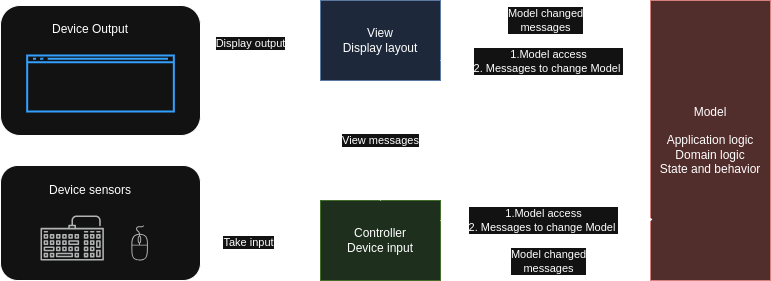
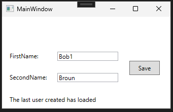
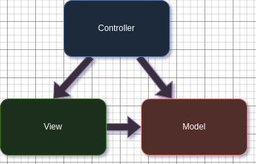

# Model View Controller (MVC)

MVC pattern types:
- Classical MVC
- MVC Model 2 (also known as `JSP Model 2` or `Web MVC` or `ASP.NET Core MVC`)

The `MVC classical pattern` was created in the late 1970s to structure user interactions with complex datasets.

Later, it was adopted for the Web and became known as the `MVC Model 2` pattern.<br>
In .net world the `ASP.NET Core MVC` framework is built on top of the `MVC Model 2` pattern.


## `Classical MVC pattern`

The `Model-View-Controller` (MVC) separates an application into three interconnected components - classes `View`s, `Model`s,`Controller`s.

### Model

In the `classical MVC` pattern, the `Model` is a class that represents the application or business logic. It can be as simple as an integer (a model of a counter) or as complex as an object with a subset of classes, representing, for example, a text editor.

- Model is not allowed to know, which device it controlled. 

- Model is not allowed to know, where it gets input from(that's the job of the Controller).

- Model can be associated with multiple views and controllers.

### View 

The `view class` deals with everything graphical. It requests data from the `Model` and outputs it to the `output device`. It displays messages, performs graphical transformations, and handles communication between `sub-views`.

- `View` is an observer to the `Model`.<br>
    In the `classical MVC` pattern, the `View` is an *observer* of the `Model` class.<br>
    Any changes made by the `Controller` to the `Model` automatically trigger a `View` update.

- `View` can be accosiated with multiple controllers, but the only one model.

- `View` can both contain and manage interactions between `sub-views`.

### Controller

The `Controller` gathers input from the input sensors — keyboard, mouse, whatever — and converts it into a method called against a `Model`. 

- `Controller` coordinates `Views`, `Models`, `Input sensors`.<br>
    The controller's job is to coordinate the `Models` and `Views` with the `input sensors` and handle scheduling tasks.

- `Controller` can be accosiated with multiple views, but the only one model.

- `Controller` can both contain and manage interactions between `sub-controller`.

#### The typical interaction cycle in the Model-View-Controller



The typical interaction cycle in the Model-View-Controller (MVC) pattern begins with user input to the device sensors.

Device sensors trigger the `Controller`, which prepares input and calls methods from the `Model`.<br>
The `Model` processes the data passed from the `Controller`, raising events that its state has changed.<br>
It notifies its dependent `Views` and `Controllers` of the change via event `messages`, sometimes passing data within those messages. 

`Views` then `query` the `Model` for its updated state and refresh their output displays as needed. 

`Controllers` may adapt their behavior based on the `Model`'s new state


### Code Example (WPF classical MVC) 

* Remark: In modern GUI frameworks like `WPF` or `Angular`, most of the functionality for interacting with `device sensors` (keyboard, mouse) and `device output` (display) is united within a `single component class`. To interact with `device sensors` or present a `view` to the user, it is enough to inherit from such a component class.



#### Input sensors & output device
The `MainWindow` class inherits from the `Window` component class and provides functionality to interact with device sensors or present a view to the user.

MainWindow.xaml.cs
```xml
<Window x:Class="WpfApp1.MainWindow"
        xmlns="http://schemas.microsoft.com/winfx/2006/xaml/presentation"
        xmlns:x="http://schemas.microsoft.com/winfx/2006/xaml"
        xmlns:d="http://schemas.microsoft.com/expression/blend/2008"
        xmlns:mc="http://schemas.openxmlformats.org/markup-compatibility/2006"
        xmlns:local="clr-namespace:WpfApp1"
        mc:Ignorable="d"
        Title="MainWindow" Height="220" Width="348">
    <Grid Margin="0,40,0,0" HorizontalAlignment="Left" Width="336" Height="153" VerticalAlignment="Top">
        <TextBox Name="FirstNameTextBox" HorizontalAlignment="Left" Margin="109,29,0,0" TextWrapping="Wrap" Text="TextBox" VerticalAlignment="Top" Width="120"/>
        <Button Name="SaveButton" Content="Save" HorizontalAlignment="Left" Margin="251,47,0,0" VerticalAlignment="Top" RenderTransformOrigin="2.07,-0.466" Height="28" Width="60" />
        <TextBox Name="SecondNameTextBox" HorizontalAlignment="Left" Margin="109,71,0,0" TextWrapping="Wrap" Text="TextBox" VerticalAlignment="Top" Width="120"/>
        <Label Name="ChangesLable" Content="Label" HorizontalAlignment="Left" Margin="10,110,0,0" VerticalAlignment="Top" Height="43" Width="301"/>
        <Label Content="FirstName:" HorizontalAlignment="Left" Margin="10,24,0,0" VerticalAlignment="Top" Height="28" Width="72"/>
        <Label Content="SecondName:" HorizontalAlignment="Left" Margin="10,66,0,0" VerticalAlignment="Top" Height="28" Width="88"/>
    </Grid>
</Window>
```

```csharp
namespace WpfApp1
{
    using PresentationLayer;
    using System.Windows;

    public partial class MainWindow : Window, IDisposable
    {
        private readonly UserController userController;

        public MainWindow()
        {
            InitializeComponent();
            this.userController = new UserController(this);
        }

        public void Dispose()
        {
            this.userController.Dispose();
        }
    }
}
```

#### Model
In the particular example the `Model` is implemented using the `Active Record` pattern. It doesn't know anything about the `Controller` or a `View`. It contains application and business logic.<br>
The `Model` class contains events that are raised when the `Model` is changed.
`Views` and `controllers` can subscribe to these events and update themselves or behave accordingly.

```csharp
namespace DomainLayer
{
    using InfrastructureLayer;
    using System.ComponentModel.DataAnnotations.Schema;

    public class UserModel
    {
        public event Action? ModelChanged;

        public event Action? ModelLoaded;

        public event Action? BusinessErrorMessageChanged;

        public async Task Create(string firstName, string secondName)
        {
            this.Id = Guid.NewGuid();
            this.SetName(firstName, secondName);

            using AppContext appContext = new();

            appContext.Users.Add(this);

            await appContext.SaveChangesAsync().ConfigureAwait(false);

            this.ModelChanged?.Invoke();
        }

        public async Task LoadLastUser()
        {
            using AppContext appContext = new();
            var user = await appContext.Users.OrderBy(user => user.Id).LastOrDefaultAsync().ConfigureAwait(false);

            if (user != null)
            {

                this.Id = user.Id;
                this.FirstName = user.FirstName;
                this.SecondName = user.SecondName;

                this.ModelLoaded?.Invoke();
            }
        }

        public Guid Id { get; private set; }

        public string? FirstName { get; private set; }

        public string? SecondName { get; private set; }

        [NotMapped]
        public string? BusinessErrorMessage { get; private set; }

        public void SetBusinessErrorMessage(string message)
        {
            this.BusinessErrorMessage = message;
            this.BusinessErrorMessageChanged?.Invoke();
        }

        public async Task ChangeName(string firstName, string secondName)
        {
            this.SetName(firstName, secondName);

            using AppContext appContext = new();

            appContext.Users.Update(this);

            await appContext.SaveChangesAsync().ConfigureAwait(false);
        }

        private void SetName(string firstName, string secondName)
        {
            if (string.IsNullOrWhiteSpace(firstName))
            {
                throw new BusinessException("First Name is required");
            }

            if (string.IsNullOrWhiteSpace(secondName))
            {
                throw new BusinessException("Second Name is required");
            }

            this.FirstName = firstName;
            this.SecondName = secondName;
        }
    }

    public class BusinessException : Exception
    {
        public BusinessException(string message) : base(message) { }
    }
}
```

##### DB

```csharp
namespace InfrastructureLayer
{
    public class AppContext : DbContext
    {
        public DbSet<UserModel> Users { get; set; }

        public bool DatabaseEnsureCreated()
        {
            return this.Database.EnsureCreated();
        }

        protected override void OnConfiguring(DbContextOptionsBuilder optionsBuilder)
        {
            var keepAliveConnection = new SqliteConnection("DataSource=test.sqlite;");
            keepAliveConnection.Open();
            optionsBuilder.UseSqlite(keepAliveConnection);
        }

        protected override void OnModelCreating(ModelBuilder modelBuilder)
        {
            modelBuilder.Entity<UserModel>().Property(user => user.Id).HasValueGenerator(typeof(SequentialGuidValueGenerator));
        }
    }
}

using System.Windows;

namespace WpfApp1;

public partial class App : Application
{
    protected override void OnStartup(StartupEventArgs e)
    {
        base.OnStartup(e);

        using InfrastructureLayer.AppContext appContext = new();
        appContext.DatabaseEnsureCreated();
    }
}
```


#### Controller

The `Controller` class keeps a reference to the `View`, to the `Model` and to the `MainWindow` classes.

Once the user enters data in the window, it is picked up by the `Controller`, then the `Controller` prepares data which is passed to the `Model`. Then, the `Model` executes application and business logic on it.

```csharp
namespace PresentationLayer
{
    public class UserController
    {
        private readonly UserModel userModel;
        private readonly UserView userView;
        private readonly MainWindow window;

        public UserController(MainWindow window)
        {
            this.window = window;

            this.userModel = new UserModel();
            this.userView = new UserView(window, userModel);

            this.window.SaveButton.Click += SaveButton_Click;
            this.window.SourceInitialized += OnSourceInitialized;
        }

        private async void OnSourceInitialized(object? sender, EventArgs e)
        {
            await this.LoadLastUser().ConfigureAwait(false);
        }

        private async void SaveButton_Click(object sender, RoutedEventArgs e)
        {
            var firstName = window.FirstNameTextBox.Text;
            var secondName = window.SecondNameTextBox.Text;

            try
            {
                await userModel.Create(firstName, secondName).ConfigureAwait(false);
            }
            catch (BusinessException ex)
            {
                userModel.SetBusinessErrorMessage(ex.Message);
            }
        }

        private async Task LoadLastUser()
        {
            try
            {
                await userModel.LoadLastUser().ConfigureAwait(false);
            }
            catch (BusinessException ex)
            {
                userModel.SetBusinessErrorMessage(ex.Message);
            }
        }

        public void Dispose()
        {
            this.window.SourceInitialized -= OnSourceInitialized;
            this.window.SaveButton.Click -= SaveButton_Click;
            this.userView.Dispose();
        }
    }
}
```

#### View

The `View` is subscribed to the `Model's` events. Once the `Model` raises an event about changes, the `View` updates GUI accordingly.

```csharp
namespace PresentationLayer
{
    public class UserView : IDisposable
    {
        private readonly MainWindow window;
        private readonly UserModel userModel;

        public UserView(MainWindow window, UserModel model)
        {
            this.window = window;
            this.userModel = model;

            //
            // View subscribes to the Model changes
            // 
            this.userModel.ModelChanged += UserModel_ModelChanged;
            this.userModel.ModelLoaded += UserModel_ModelLoaded;
            this.userModel.BusinessErrorMessageChanged += UserModel_BusinessErrorMessageChanged;
        }

        private void UserModel_BusinessErrorMessageChanged()
        {
            window.Dispatcher.Invoke(() =>
            {
                window.ChangesLable.Content = this.userModel.BusinessErrorMessage;
            });
        }

        private void UserModel_ModelLoaded()
        {
            window.Dispatcher.Invoke(() =>
            {
                window.FirstNameTextBox.Text = this.userModel.FirstName;
                window.SecondNameTextBox.Text = this.userModel.SecondName;
                window.ChangesLable.Content = $"The last user created has loaded";
            });
        }

        /// <summary>
        /// When the model changes, the view updates the UI
        /// </summary>
        private void UserModel_ModelChanged()
        {
            window.Dispatcher.Invoke(() =>
            {
                window.FirstNameTextBox.Text = "";
                window.SecondNameTextBox.Text = "";
                window.ChangesLable.Content = $"Changes saved. User: {this.userModel.FirstName} {this.userModel.SecondName}";
            });
        }

        public void Dispose()
        {
            this.userModel.ModelLoaded -= UserModel_ModelLoaded;
            this.userModel.ModelChanged -= UserModel_ModelChanged;
            this.userModel.BusinessErrorMessageChanged -= UserModel_BusinessErrorMessageChanged;
        }
    }
}
```


## `MVC Model 2` pattern

`MVC Model 2` represents an adopted version of the MVC pattern for web applications.

Traditionally, a web page has to send a request to the server to receive new data; that is, the page requests data from the server. <br>
Without additional technologies implemented above `WebSockets`, `long polling`, `ajax`, `server-sent events`,`WebTransport` web applications cannot reactively update the UI and in several different places.

This introduces certain simplifications and restrictions to the MVC Model 2 pattern compared to the classical MVC.



### Controller

Controller receives data from the HTTP request, pass it to the `Model`. When the logic within the `Model` is executed and the result is received by the `Controller`, the `Controller` selects a `View` to render the `Model`.

- `Controller` can be accosiated with multiple views, and multiple models.<br>
    If the `Controller` interacts with multiple `Models` or complex `Model`, an additional `ViewModel` can be created for the specific `View` to simplify mapping of data.


 work with the model, and ultimately select a view to render. 

### Model 
The `Model` has the same responsibilities as in the `classical MVC pattern`, except there is no need to create `events` and notify the `Controller` about changes done in the `Model`, as the `Controller` receives a result from the `Model` within the same `HTTP request-response`.

### View 
`Views` are responsible for presenting content through the user interface. In ASP.NET Core, the Razor view engine is used to convert .NET and HTML markup code into an HTML web page.

### Code Example

#### View

```html
@{
    ViewData["Title"] = "User";
}

@model DomainLayer.UserModel

<h2>User</h2>

Id: @Model.Id <br />  
Name: @Model.Name <br />

```

### Controller + Model

```csharp
namespace WebApplication1.Controllers
{
    using DomainLayer;
    using Microsoft.AspNetCore.Mvc;

    public class UserController : Controller
    {
        [HttpGet]
        public IActionResult Index(int userId)
        {
            var model = UserModel.LoadUser(userId);

            return View(model);
        }
    }
}

namespace DomainLayer
{
    public class UserModel
    {
        public int Id { get; set; }

        public string Name { get; set; }

        public static UserModel LoadUser(int userId)
        {
            // Load from the DB ..
            return new UserModel { Id = userId, Name = "John Doe" };
        }
    }
}
```