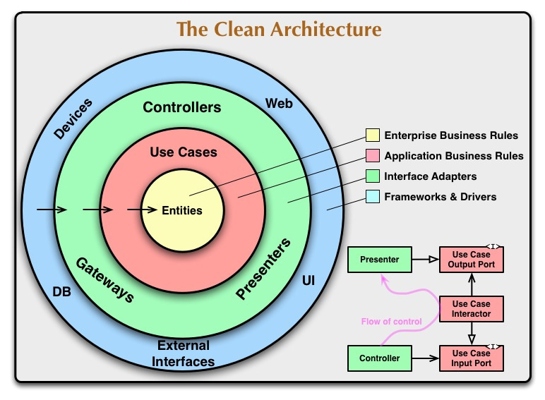
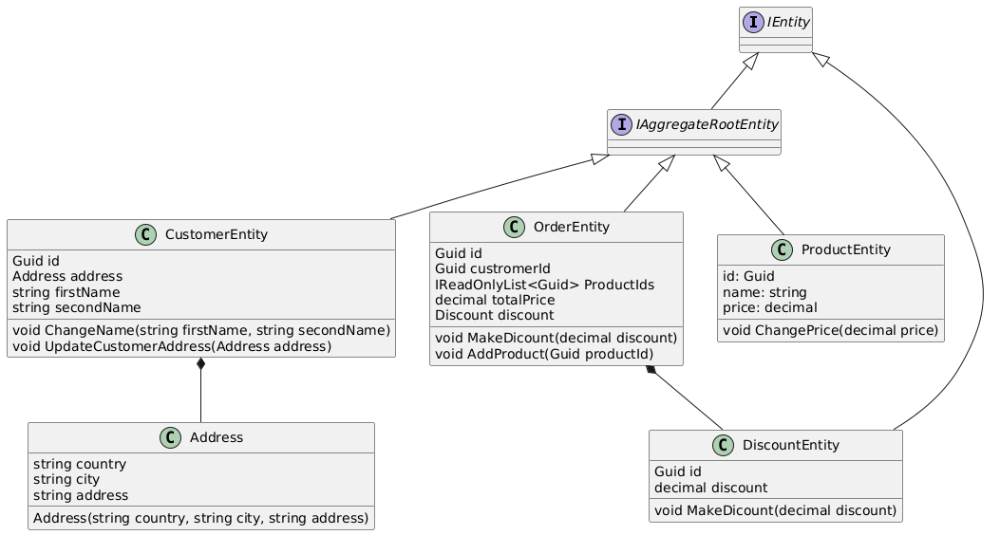
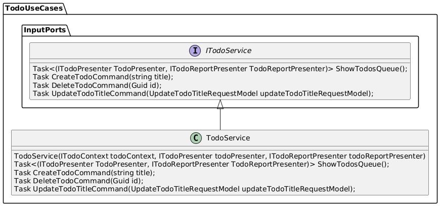
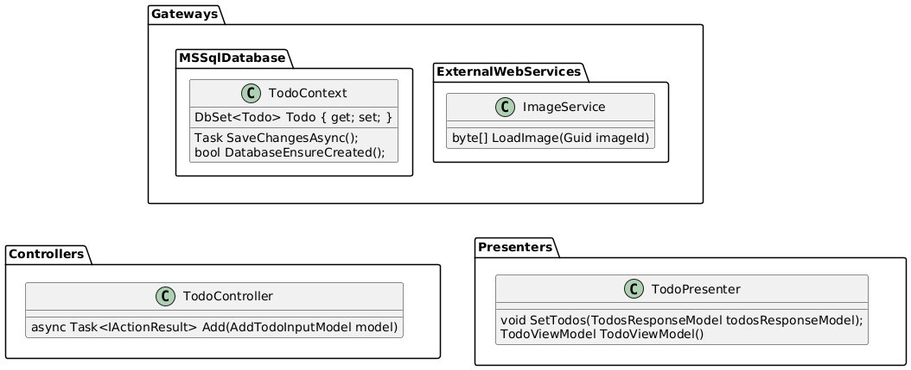
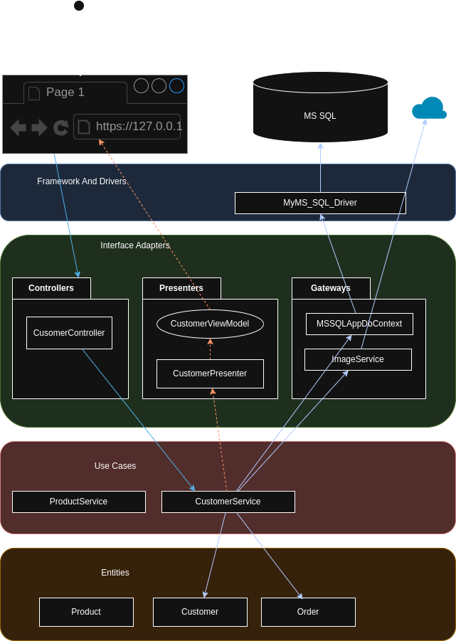
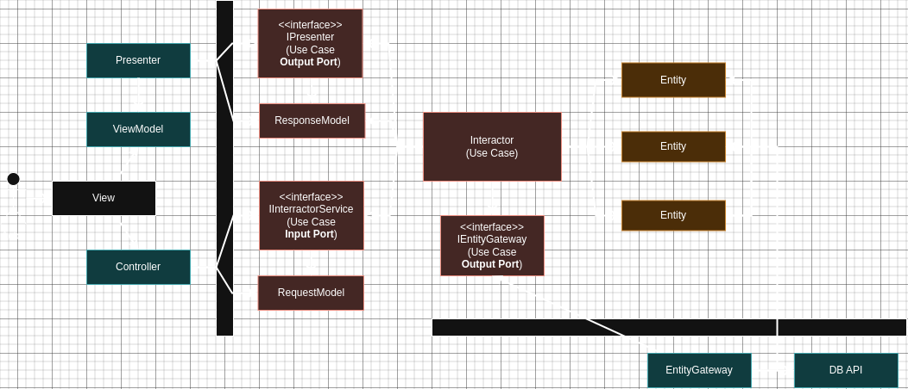
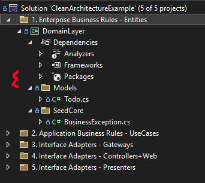
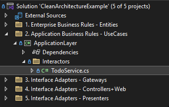
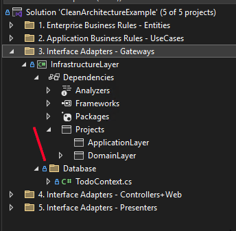

# Clean architecture

`Clean Architecture` is a software design philosophy and architectural pattern that emphasizes the separation of concerns and the independence of frameworks and tools. 

The goals of clean architecture are to make applications:

- Independent of third-party libraries and frameworks.
- Independent of databases and file systems.
- Independent of external services and agents.
- Easy to test business rules.



### Layers

Clean architecture generally contains four main layers:

- Enterprise Business Rules layer
- Application Business Rules layer
- Interface Adapters layer
- Frameworks & Drivers

The architecture is flexible in terms of the number of layers, but the core principle is always the strict application of the `Dependency Rule`.

### Dependency Rule
Clean Architecture splits applications into `layers`, where inner layers represent `policies` and outer layers represent `mechanisms`.

`Policies` represent the core business rules, logic, and decisions of the application. They define what the system should do, independent of how it's done.   

Examples:
- Calculating taxes
- Determining customer eligibility for a discount
- Processing an order   
- Validating user input

`Mechanisms` refer to the technical details and implementation specifics of how the policies are carried out. They define how the system achieves the goals defined by the policies.

Examples:
- Database interactions (storing and retrieving data)
- User interface elements (how data is presented to the user)
- Communication with external services (APIs)
- Framework-specific implementations (using a particular library or framework)

##### Dependency Rule
The main rule that drives this architecture is the `Dependency Rule`.
> Dependencies in source code should be directed inward, towards high-level policies.

Inner layers must remain completely isolated from any details declared in outer layers.

No constant, class, function, or variable defined in the outer circle should be used within the inner circle.


#### Entities

Entities encapsulate enterprise-wide business rules. An entity can be an object with methods or a set of data structures and functions. The key is that these entities should be reusable across multiple applications within the enterprise.

Example

<hidden style="display:none">
@startuml

interface IEntity
interface IAggregateRootEntity

IEntity <|-- IAggregateRootEntity

class CustomerEntity {
  Guid id 
  Address address 
  string firstName 
  string secondName 

  void ChangeName(string firstName, string secondName)
  void UpdateCustomerAddress(Address address)
}
IAggregateRootEntity <|-- CustomerEntity

class Address {
  string country
  string city
  string address

  Address(string country, string city, string address)
}

CustomerEntity *-- Address

class OrderEntity
{
  Guid id
  Guid custromerId
  IReadOnlyList<Guid> ProductIds
  decimal totalPrice 
  Discount discount

  void MakeDicount(decimal discount)
  void AddProduct(Guid productId) 
}

IAggregateRootEntity <|-- OrderEntity

class DiscountEntity{
  Guid id
  decimal discount
  void MakeDicount(decimal discount)
}

IEntity <|-- DiscountEntity
OrderEntity *-- DiscountEntity

class ProductEntity{
  id: Guid
  name: string 
  price: decimal

  void ChangePrice(decimal price)
}

IAggregateRootEntity <|-- ProductEntity

@enduml
</hidden>



#### Use Cases

This layer houses the *application-specific logic*. It organizes the flow of data into the Entities. After the Entities apply business rules on the data within the Entities layer, the Use Case layer passes out the handled data to the outer layer.

Any changes in `Application Business Rules layer` will not affect code in `Enterprise Business Rules layer`.

At the same time, the `Application Business Rules layer` knows nothing about outer layers. <br>
This layer operates on interfaces, whose implementations reside in other layers.<br>
It doesn't know about how the `ImageService` saves images or how the `AppDbContext` saves data in the database.


Example

<hidden style="display:none">
@startuml

package TodoUseCases{

  package InputPorts{
    interface ITodoService{
      Task<(ITodoPresenter TodoPresenter, ITodoReportPresenter TodoReportPresenter)> ShowTodosQueue();
      Task CreateTodoCommand(string title);
      Task DeleteTodoCommand(Guid id);
      Task UpdateTodoTitleCommand(UpdateTodoTitleRequestModel updateTodoTitleRequestModel);
    }
  }


  class TodoService{    
   TodoService(ITodoContext todoContext, ITodoPresenter todoPresenter, ITodoReportPresenter todoReportPresenter) 
    Task<(ITodoPresenter TodoPresenter, ITodoReportPresenter TodoReportPresenter)> ShowTodosQueue();
    Task CreateTodoCommand(string title);
    Task DeleteTodoCommand(Guid id);
    Task UpdateTodoTitleCommand(UpdateTodoTitleRequestModel updateTodoTitleRequestModel);
  }

  ITodoService <|-- TodoService
}
@enduml
</hidden>



### Interface Adapters

The `Interface Adapters layer` acts as a bridge between external resources (like the Web or a Database) and the `Application Business Rules layer`, converting data into a format that the `Application Business Rules layer` can understand.<br>
For the `Web`: This layer can contain code related to the MVC pattern, including controllers, views, and models.<br>
For the `Database`: This layer can contain code that loads data from the Database.<br>
For the `external service`: This layer can contain code that interacts with services from other web applications.

Example

<hidden style="display:none">
@startuml

package Gateways{

  package MSSqlDatabase{
    class TodoContext{
      DbSet<Todo> Todo { get; set; }
      Task SaveChangesAsync();
      bool DatabaseEnsureCreated();
    }
  }

  package ExternalWebServices{
    class ImageService{
      byte[] LoadImage(Guid imageId)
    }
  }
}

package Controllers{
  class TodoController{
    async Task<IActionResult> Add(AddTodoInputModel model)
  }
}

package Presenters{
  class TodoPresenter{
    void SetTodos(TodosResponseModel todosResponseModel);
    TodoViewModel TodoViewModel()
  }
}

Gateways -[hidden]-> Controllers
Gateways -[hidden]-> Presenters

@enduml
</hidden>



### Frameworks & Drivers

The outermost layer is generally composed of frameworks and tools, such as the Database and the Web Framework. Typically, this layer requires only minimal 'glue code' to interface with the next inner circle.

### Control flow

**Request from the UI**: A user interacts with the user interface, triggering a request. This could be anything, like clicking a button or submitting a form.   

**Controller**: The request is received by a controller in the `Presentation layer`. The controller's job is to translate the request into a format that the `Use Case` layer can understand. It doesn't contain any business logic itself.   

**Use Case**: The controller calls a specific `Use Case` in the `Application layer`. This `Use Case` encapsulates the business logic for that particular request. It orchestrates the necessary actions, potentially interacting with entities in the `Domain layer`.   

**Entities**: The `Use Case` might interact with entities in the `Domain layer`. `Entities` represent the core concepts of the application and contain business logic related to those concepts.   

**Data Access**: If the `Use Case` needs to retrieve or store data, it will interact with an interface in the `Application layer`, which handles the specifics of data access (e.g., database, API), and which implementation resides in the `Infrastructure layer`.   

**Presenter**: Once the `Use Case` has completed its work, it passes the *results*(data) to a `Presenter` in the `Presentation layer`. The `Presenter's` job is to **format the data** in a way that the UI can understand.   

**UI Update**: The `Presenter` updates the UI with the results of the Use Case.



Presenters, gateways, and controllers are just plugins to the application.



### Code Example

#### ASP .NET Core MVC(with Razor) Example of the TODO web application

[clean-architecture-example of TODO application](https://github.com/ichensky/clean-architecture-example/)


##### Domain Layer


The domain layer contains entities (models like the Todo model) that encapsulate enterprise business rules.<br>
This layer also includes input/output port interfaces.<br>
Domain layer library doesn't have any dependecies to the libraries from other libraries in this project.<br>
The domain layer library has no dependencies on other libraries in this project.

##### Application Layer



The application layer contains use case interactors. The TodoService interactor calls methods from input/output port plugins.<br>
The interactor specifies not only **how** the UI is updated and **what** data is saved or provided to the UI, but also **when** the data will be available.

```csharp
public class TodoService(ITodoContext todoContext, ITodoPresenter todoPresenter, ITodoReportPresenter todoReportPresenter) : ITodoService
{
    public async Task<(ITodoPresenter, ITodoReportPresenter)> ShowTodosQueue()
    {
        var todo = await todoContext.Todo.AsNoTracking().OrderByDescending(todo => todo.Date).ToListAsync();

        var todosResponseModel = new TodosResponseModel(todo);

        todoPresenter.SetTodos(todosResponseModel);
        todoReportPresenter.SetTodos(todosResponseModel);

        return (todoPresenter, todoReportPresenter);
    }

    public async Task CreateTodoCommand(string title)
    {
        var todo = new Todo(title);

        todoContext.Todo.Add(todo);

        await todoContext.SaveChangesAsync();
    }
    ...
}
```

##### Infrastructure Layer



The infrastructure layer contains gateways to interact with external resources, such as databases and services.