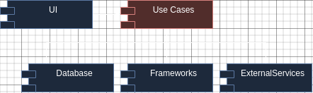
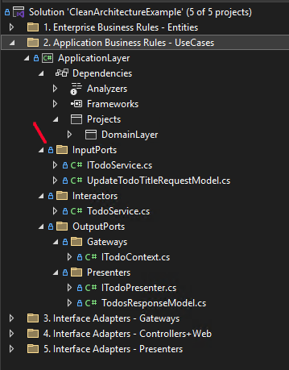
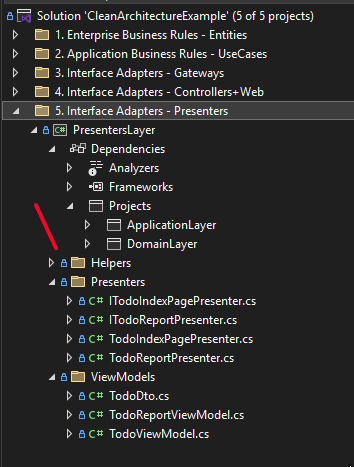

# Clean architecture

`Clean Architecture` is a software design philosophy and architectural pattern that emphasizes the separation of concerns and the independence of frameworks and tools. 

The goals of clean architecture are to make applications:

- Independent of third-party libraries and frameworks.
- Independent of databases and file systems.
- Independent of external services and agents.
- Easy to test business rules.


### Layers

Clean architecture generally contains four main layers:

- Enterprise Business Rules layer
- Application Business Rules layer
- Interface Adapters layer
- Frameworks & Drivers

The architecture is flexible in terms of the number of layers, but the core principle is always the strict application of the `Dependency Rule`.

### Dependency Rule
Clean Architecture splits applications into `layers`, where inner layers represent `policies` and outer layers represent `mechanisms`.

`Policies` represent the core business rules, logic, and decisions of the application. They define what the system should do, independent of how it's done.   

Examples:
- Calculating taxes
- Determining customer eligibility for a discount
- Processing an order   
- Validating user input

`Mechanisms` refer to the technical details and implementation specifics of how the policies are carried out. They define how the system achieves the goals defined by the policies.

Examples:
- Database interactions (storing and retrieving data)
- User interface elements (how data is presented to the user)
- Communication with external services (APIs)
- Framework-specific implementations (using a particular library or framework)

##### Dependency Rule
The main rule that drives this architecture is the `Dependency Rule`.
> Dependencies in source code should be directed inward, towards high-level policies.

Inner layers must remain completely isolated from any details declared in outer layers.

No constant, class, function, or variable defined in the outer circle should be used within the inner circle.


#### Entities

Entities encapsulate enterprise-wide business rules. An entity can be an object with methods or a set of data structures and functions. The key is that these entities should be reusable across multiple applications within the enterprise.

Example

<hidden style="display:none">
@startuml

interface IEntity
interface IAggregateRootEntity

IEntity <|-- IAggregateRootEntity

class CustomerEntity {
  Guid id 
  Address address 
  string firstName 
  string secondName 

  void ChangeName(string firstName, string secondName)
  void UpdateCustomerAddress(Address address)
}
IAggregateRootEntity <|-- CustomerEntity

class Address {
  string country
  string city
  string address

  Address(string country, string city, string address)
}

CustomerEntity *-- Address

class OrderEntity
{
  Guid id
  Guid custromerId
  IReadOnlyList<Guid> ProductIds
  decimal totalPrice 
  Discount discount

  void MakeDicount(decimal discount)
  void AddProduct(Guid productId) 
}

IAggregateRootEntity <|-- OrderEntity

class DiscountEntity{
  Guid id
  decimal discount
  void MakeDicount(decimal discount)
}

IEntity <|-- DiscountEntity
OrderEntity *-- DiscountEntity

class ProductEntity{
  id: Guid
  name: string 
  price: decimal

  void ChangePrice(decimal price)
}

IAggregateRootEntity <|-- ProductEntity

@enduml
</hidden>


#### Use Cases

This layer houses the *application-specific logic*. It organizes the flow of data into the Entities. After the Entities apply business rules on the data within the Entities layer, the Use Case layer passes out the handled data to the outer layer.

Any changes in `Application Business Rules layer` will not affect code in `Enterprise Business Rules layer`.

At the same time, the `Application Business Rules layer` knows nothing about outer layers. <br>
This layer operates on interfaces, whose implementations reside in other layers.<br>
It doesn't know about how the `ImageService` saves images or how the `AppDbContext` saves data in the database.


Example

<hidden style="display:none">
@startuml

package TodoUseCases{

  package InputPorts{
    interface ITodoService{
      Task<(ITodoPresenter TodoPresenter, ITodoReportPresenter TodoReportPresenter)> ShowTodosQueue();
      Task CreateTodoCommand(string title);
      Task DeleteTodoCommand(Guid id);
      Task UpdateTodoTitleCommand(UpdateTodoTitleRequestModel updateTodoTitleRequestModel);
    }
  }


  class TodoService{    
   TodoService(ITodoContext todoContext, ITodoPresenter todoPresenter, ITodoReportPresenter todoReportPresenter) 
    Task<(ITodoPresenter TodoPresenter, ITodoReportPresenter TodoReportPresenter)> ShowTodosQueue();
    Task CreateTodoCommand(string title);
    Task DeleteTodoCommand(Guid id);
    Task UpdateTodoTitleCommand(UpdateTodoTitleRequestModel updateTodoTitleRequestModel);
  }

  ITodoService <|-- TodoService
}
@enduml
</hidden>


### Interface Adapters

The `Interface Adapters layer` acts as a bridge between external resources (like the Web or a Database) and the `Application Business Rules layer`, converting data into a format that the `Application Business Rules layer` can understand.<br>
For the `Web`: This layer can contain code related to the MVC pattern, including controllers, views, and models.<br>
For the `Database`: This layer can contain code that loads data from the Database.<br>
For the `external service`: This layer can contain code that interacts with services from other web applications.

Example

<hidden style="display:none">
@startuml

package Gateways{

  package MSSqlDatabase{
    class TodoContext{
      DbSet<Todo> Todo { get; set; }
      Task SaveChangesAsync();
      bool DatabaseEnsureCreated();
    }
  }

  package ExternalWebServices{
    class ImageService{
      byte[] LoadImage(Guid imageId)
    }
  }
}

package Controllers{
  class TodoController{
    async Task<IActionResult> Add(AddTodoInputModel model)
  }
}

package Presenters{
  class TodoPresenter{
    void SetTodos(TodosResponseModel todosResponseModel);
    TodoViewModel TodoViewModel()
  }
}

Gateways -[hidden]-> Controllers
Gateways -[hidden]-> Presenters

@enduml
</hidden>


### Frameworks & Drivers

The outermost layer is generally composed of frameworks and tools, such as the Database and the Web Framework. Typically, this layer requires only minimal 'glue code' to interface with the next inner circle.

### Control flow

**Request from the UI**: A user interacts with the user interface, triggering a request. This could be anything, like clicking a button or submitting a form.   

**Controller**: The request is received by a controller in the `Controllers layer`. The controller's job is to translate the request into a format that the `Use Case` layer can understand. It doesn't contain any business logic itself.   

**Use Case**: The controller calls a specific `Use Case` in the `Application layer`. This `Use Case` encapsulates the business logic for that particular request. It orchestrates the necessary actions, potentially interacting with entities in the `Domain layer`.   

**Entities**: The `Use Case` might interact with entities in the `Domain layer`. `Entities` represent the core concepts of the application and contain business logic related to those concepts.   

**Data Access**: If the `Use Case` needs to retrieve or store data, it will interact with an interface in the `Application layer`, which handles the specifics of data access (e.g., database, API), and which implementation resides in the `Infrastructure layer`.   

**Presenter**: Once the `Use Case` has completed its work, it passes the *results*(data) to a `Presenter` in the `Presentation layer`. The `Presenter's` job is to **format the data** in a way that the UI can understand.   

**UI Update**: The `Presenter` updates the UI with the results of the `Use Case`.

##### Clean arhitecture control flow `class` UML diagram:


* Open arrowheads are using relationships. 
* Closed arrowheads are implements or inheritance relationships

**Presenters, gateways, and controllers are just plugins to the application.**

##### Clean arhitecture control flow `components` UML diagrams:


Controller-presenter details:


* The component relationships are indirectional.

##### Data flow diagram:<br> 


### Clean arhitecture Code Example

#### ASP .NET Core MVC(with Razor) Example of the TODO web application

[clean-architecture-example of TODO application](https://github.com/ichensky/clean-architecture-example/)


##### Domain Layer


The domain layer contains `entities` (models like the Todo model) that encapsulate enterprise business rules.

```csharp
    public class Todo
    {
        public Todo() { }

        public Todo(string title)
        {
            Id = Guid.NewGuid();
            Date = DateTime.UtcNow;
            SetTitle(title);
        }

        public Guid Id { get; protected set; }

        public string Title { get; protected set; }

        public DateTime Date { get; protected set; }

        public DateTime UpdateDate { get; protected set; }

        public void UpdateTitle(string title)
        {
            SetTitle(title);
        }

        private void SetTitle(string title)
        {
            if (string.IsNullOrWhiteSpace(title))
            {
                throw new BusinessException("Title cannot be empty");
            }

            if (title.Length > 100)
            {
                throw new BusinessException("Title cannot be longer than 100 characters");
            }

            Title = title;
        }
    }
```

The domain layer library has no dependencies on other libraries in this project.
This layer can also contain interfaces that can be reused by other outer layers.

##### Application Layer



The application layer contains use case interactors, that calls methods from input/output port plugins.<br>
The `TodoService` interactor implement `Input Port` interface `ITodoService` and use `Ouput Port interfaces`: `ITodoPresenter`, `ITodoContext`.

This layer is unaware of which database is used or how data is presented in the View. It mainly contains command methods that modify Entities and query methods that list Entities.

The application layer has a dependency only on the `inner` domain layer.

```csharp
namespace ApplicationLayer.Interactors;

public class TodoService(ITodoContext todoContext) : ITodoService
{
    public async Task PrintTodosQuery(ITodoPresenter todoPresenter)
    {
        var todo = await todoContext.Todo.AsNoTracking().OrderByDescending(todo => todo.Date).ToListAsync();

        var todosResponseModel = new TodosResponseModel(todo);

        todoPresenter.SetTodos(todosResponseModel);
    }

    public async Task CreateTodoCommand(string title)
    {
        var todo = new Todo(title);

        todoContext.Todo.Add(todo);

        await todoContext.SaveChangesAsync();
    }

    //...

    public async Task DeleteTodoCommand(Guid id)
    {
        if (id == Guid.Empty)
        {
            throw new ArgumentException("Invalid id");
        }

        var todo = await TryGetTodoById(id) ?? throw new InvalidOperationException("Todo not found");

        todoContext.Todo.Remove(todo);

        await todoContext.SaveChangesAsync();
    }

    //...
}
```

This layer also includes input/output port interfaces.

##### Input Port interfaces:
```csharp
namespace DomainLayer.SeedCore.InputPorts;

public interface ITodoService
{
    Task PrintTodosQuery(ITodoPresenter todoPresenter);

    Task CreateTodoCommand(string title);

    Task DeleteTodoCommand(Guid id);

    Task UpdateTodoTitleCommand(UpdateTodoTitleRequestModel updateTodoTitleRequestModel);
}
```
The `input port` takes `RequestModel` as a parameter, which is data received from the User and handled by the interactor.

##### Output Port interfaces:
```csharp
namespace DomainLayer.SeedCore.OutputPorts.Presenters;

public interface ITodoPresenter
{
    void SetTodos(TodosResponseModel todosResponseModel);
}
```
```csharp
namespace ApplicationLayer.OutputPorts.Gateways;

public interface ITodoContext
{
    DbSet<Todo> Todo { get; set; }

    Task SaveChangesAsync();

    bool DatabaseEnsureCreated();
}
```
The `output port` takes `ResponseModel` as a parameter, which is then used to either `save` `Entities`, `query` `Entities`, or `display` `Entities` on the output terminal/source.

##### Infrastructure Layer


The infrastructure layer contains gateways to interact with external resources, such as databases and services.

The infrastructure layer has a `dependency` on the inner layers: `domain layer` and `application layer`.

```csharp
public class TodoContext : DbContext, ITodoContext
{
    public DbSet<Todo> Todo { get; set; }

    public Task SaveChangesAsync()
    {
        return base.SaveChangesAsync();
    }
    ...
}

```

##### Presentation Layer



The presentation layer consists of `Presenters` that implement `Output Port` interfaces and adapt `Response Models` to `View models`, which are then passed or bound to the View.<br>

The presentation layer has a `dependency` on the inner layers: `domain layer` and `application layer`.

TodoIndexPagePresenter: 
```csharp
public class TodoIndexPagePresenter : ITodoIndexPagePresenter
{
    private TodosResponseModel todosResponseModel;

    public void SetTodos(TodosResponseModel todosResponseModel)
    {
        ArgumentNullException.ThrowIfNull(todosResponseModel, nameof(todosResponseModel));

        this.todosResponseModel = todosResponseModel;
    }

    public TodoViewModel GetViewModel()
    {
        return new TodoViewModel
        {
            Title = string.Empty,
            Todos = [.. todosResponseModel.Todos.Select(todo => new TodoDto(
                todo.Id,
                todo.Title,
                todo.Date.ToString("yyyy-MM-dd")))]
        };
    }
}
```
TodoReportPresenter:
```csharp
public class TodoReportPresenter : ITodoReportPresenter
{
    private TodosResponseModel todosResponseModel;

    public void SetTodos(TodosResponseModel todosResponseModel)
    {
        ArgumentNullException.ThrowIfNull(todosResponseModel, nameof(todosResponseModel));

        this.todosResponseModel = todosResponseModel;
    }

    public string GetReport()
    {
        if (todosResponseModel.Todos.Count == 0)
        {
            return $"""
                    There are no todos.
                    Date: {DateTime.Now:yyyy - MM - dd.hh:mm}
                    """;
        }

        return $"""
                There are {todosResponseModel.Todos.Count} todos.
                Date: {DateTime.Now:yyyy - MM - dd.hh:mm}

                Todos: 
                {string.Join(Environment.NewLine,
                    todosResponseModel.Todos
                        .Select(todo => $"{todo.Date:yyyyy - MM - dd.hh:mm}: {todo.Title}"))}
                """;
    }
}
```

##### Controllers Layer


In the current application, this layer contains the Controllers layer and the main application code that starts and configures the application.

Ideally, the `controllers layer` should be separated into a `distinct library`, for simplicity, this is omitted.

The `controllers layer` has a `dependency` only on the inner layers: `domain layer` and `application layer`.
But main application code has dependency on all layers.

The controller calls the application layer to execute application logic, then calls a presenter to generate a view model, and passes it to the Razor Engine, which converts it to an HTML page or uploads a generated report as a file. 

`TodoController`:
```csharp
public class TodoController(ITodoService todoService, ITodoIndexPagePresenter todoIndexPagePresenter) : Controller
namespace CleanArchitectureExample.Controllers;

public class TodoController(ITodoService todoService, 
    ITodoIndexPagePresenter todoIndexPagePresenter, 
    ITodoReportPresenter todoReportPresenter) : Controller
{
    [HttpGet]
    public async Task<IActionResult> Index()
    {
        return await ShowIndexView();
    }

    [HttpPost]
    public async Task<IActionResult> Report()
    {
        await todoService.PrintTodosQuery(todoReportPresenter);

        var report = todoReportPresenter.GetReport();

        return File(Encoding.Unicode.GetBytes(report), "text/plain", "TodosReport.txt");
    }


    [HttpPost]
    public async Task<IActionResult> Add(AddTodoInputModel model)
    {
        await todoService.CreateTodoCommand(model.Title);

        return await ShowIndexView();
    }

    [HttpPost]
    public async Task<IActionResult> Delete(DeleteTodoInputModel model)
    {
        await todoService.DeleteTodoCommand(model.Id);

        return await ShowIndexView();
    }

    private async Task<IActionResult> ShowIndexView()
    {
        await todoService.PrintTodosQuery(todoIndexPagePresenter);

        var viewModel = todoIndexPagePresenter.GetViewModel();

        return View("Index", viewModel);
    }
}
```
#### Clean arhitecture control flow components UML diagram:


* The component relationships are indirectional.