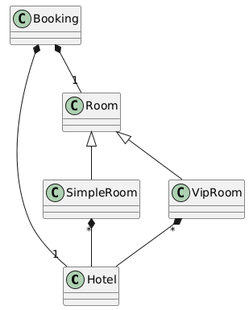
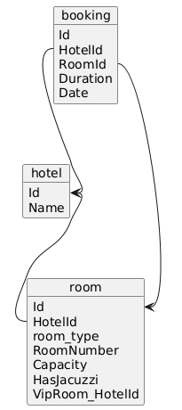

# Domain Model

Domain models are a crucial aspect of object-oriented programming, representing real-world entities and their relationships within a software system. They encapsulate both data and behavior, leading to more modular, maintainable, and reusable code.

It is important to understand that the primary focus of a domain model is not on data itself, but on the behavior that it operates on. A Domain Model unites functions that are most likely to be used together.

Comparing to `Table Module` pattern, `Domain Model` doesn't depend on the Database. It doesn't matter **where** and **how** the `object` will be saved.

In the long term, the code written with a `Domain Model` is easier to support and maintain compared to the `Table Module` pattern and especially `Transaction Script`.

### Example

The `DomainLayer` has domain class models `VipRoom` and `SimpleRoom`, while the `DataAccess layer` saves both in the `same table`.

###### Domain Model schema
<hidden style="display:none">
@startuml
class Hotel
class Room
class SimpleRoom
class VipRoom
class Booking

Room <|-- SimpleRoom
Room <|-- VipRoom
Booking *-- "1" Room
Booking *-- "1" Hotel
SimpleRoom "*" *-- Hotel
VipRoom "*" *-- Hotel
@enduml
</hidden>



###### DB schema
<hidden style="display:none">
@startuml
object hotel {
   Id 
   Name  
}

object room {
   Id 
   HotelId 
   room_type
   RoomNumber
   Capacity 
   HasJacuzzi
   VipRoom_HotelId
}

object booking {
   Id 
   HotelId 
   RoomId 
   Duration 
   Date 
}

hotel::Id <-- room::HotelId  
booking::RoomId --> room::Id
booking::HotelId --> hotel::Id

@enduml
</hidden>


##### Implementation
```csharp
using DataAccessLayer;
using DomainLayer;
using Microsoft.Data.Sqlite;
using Microsoft.EntityFrameworkCore;
using PresentationLayer;

await new MainController().Main();

namespace PresentationLayer
{
    public class MainController
    {
        public async Task Main()
        {
            using var dbContext = new AppDbContext();
            var isCreated = await dbContext.Database.EnsureCreatedAsync();
            var script = dbContext.Database.GenerateCreateScript();

            await CreateHotelWithRoomsAndBookings();

            await CancellAllBookigsInAllHotes();
        }

        private async Task CreateHotelWithRoomsAndBookings()
        {
            using var dbContext = new AppDbContext();

            var hotel = new Hotel("Hotel1");
            await dbContext.AddAsync(hotel);

            await dbContext.SaveChangesAsync();

            var vipRoom = new VipRoom(hotel, 1, 2, true);
            var simpleRoom = new SimpleRoom(hotel, 2, 2);
            await dbContext.AddAsync(vipRoom);
            await dbContext.AddAsync(simpleRoom);

            await dbContext.SaveChangesAsync();

            var booking1 = new Booking(simpleRoom, hotel, DateTime.Now.AddDays(1), 2);
            var booking2 = new Booking(vipRoom, hotel, DateTime.Now.AddDays(2), 3);

            await dbContext.AddAsync(booking1);
            await dbContext.AddAsync(booking2);

            await dbContext.SaveChangesAsync();
        }

        private async Task CancellAllBookigsInAllHotes()
        {
            using var dbContext = new AppDbContext();

            var allHotels = await dbContext.Hotels.Include(hotel=>hotel.Bookings).ToListAsync();

            foreach (var hotel in allHotels)
            {
                hotel.CancellAllBookings();
            }

            dbContext.UpdateRange(allHotels);

            await dbContext.SaveChangesAsync();
        }
    }
}

namespace DomainLayer
{
    public class Hotel
    {
        public Hotel() { }

        public Hotel(string name)
        {
            this.Id = Guid.NewGuid();
            this.Name = name;
        }

        public Guid Id { get; set; }

        public string Name { get; set; }

        public virtual ICollection<VipRoom> VipRooms { get; set; } = [];

        public virtual ICollection<SimpleRoom> SimpleRooms { get; set; } = [];

        public virtual ICollection<Booking> Bookings { get; set; } = [];

        public void AddBooking(Booking booking)
        {
            if (booking.Date < DateTime.Now)
            {
                throw new ArgumentException("Date must be in the future");
            }

            if (booking.Duration < 1)
            {
                throw new ArgumentException("Duration must be at least 1 day");
            }

            if (this.Bookings.Any(b => b.Date == booking.Date))
            {
                throw new ArgumentException("There is already a booking for this date");
            }

            this.Bookings.Add(booking);
        }
        public void CancellAllBookings()
        {
            this.Bookings.Clear();
        }
    }

    public abstract class Room
    {
        public Room() { }

        public Room(Hotel hotel, int roomNumber, int capacity)
        {
            this.Id = Guid.NewGuid();
            this.Hotel = hotel;
            this.RoomNumber = roomNumber;
            this.Capacity = capacity;
        }

        public Guid Id { get; set; }

        public int RoomNumber { get; set; }

        public int Capacity { get; set; }

        public virtual Hotel Hotel { get; set; }
    }

    public sealed class SimpleRoom : Room
    {
        public SimpleRoom() { }

        public SimpleRoom(Hotel hotel, int roomNumber, int capacity) : base(hotel, roomNumber, capacity)
        {
        }
    }

    public sealed class VipRoom : Room
    {
        public VipRoom() { }

        public VipRoom(Hotel hotel, int roomNumber, int capacity, bool hasJacuzzi) : base(hotel, roomNumber, capacity)
        {
            HasJacuzzi = hasJacuzzi;
        }

        public bool HasJacuzzi { get; set; }
    }

    public class Booking
    {
        public Booking() { }

        public Booking(Room room, Hotel hotel, DateTime date, int duration)
        {
            if (duration < 1)
            {
                throw new ArgumentException("Duration must be at least 1 day");
            }

            if (date < DateTime.Now)
            {
                throw new ArgumentException("Date must be in the future");
            }

            this.Id = Guid.NewGuid();
            this.Room = room;
            this.Hotel = hotel;
            this.Date = date;
            this.Duration = duration;
        }

        public Guid Id { get; set; }

        public DateTime Date { get; set; }

        public int Duration { get; set; }

        public virtual Room Room { get; set; }

        public virtual Hotel Hotel { get; set; }
    }
}

namespace DataAccessLayer
{
    public class AppDbContext : DbContext
    {
        public DbSet<Hotel> Hotels { get; set; }

        public DbSet<VipRoom> VipRooms { get; set; }

        public DbSet<SimpleRoom> SimpleRooms { get; set; }

        protected override void OnConfiguring(DbContextOptionsBuilder optionsBuilder)
        {
            var keepAliveConnection = new SqliteConnection("DataSource=myshareddb;mode=memory;cache=shared");
            keepAliveConnection.Open();

            optionsBuilder.UseSqlite(keepAliveConnection);
        }

        protected override void OnModelCreating(ModelBuilder modelBuilder)
        {
            // VipRoom and SimpleRoom are saved in the same table
            const string roomType = "room_type";

            modelBuilder.Entity<Hotel>()
                .ToTable("hotel");

            modelBuilder.Entity<Room>()
                .ToTable("room");

            modelBuilder.Entity<SimpleRoom>()
                .HasDiscriminator<string>(roomType)
                .HasValue<SimpleRoom>(typeof(SimpleRoom).ToString());

            modelBuilder.Entity<VipRoom>()
                .HasDiscriminator<string>(roomType)
                .HasValue<VipRoom>(typeof(VipRoom).ToString());

            modelBuilder.Entity<Booking>()
                .ToTable("booking");
        }
    }
}
```
```sql
CREATE TABLE "hotel" (
    "Id" TEXT NOT NULL CONSTRAINT "PK_hotel" PRIMARY KEY,
    "Name" TEXT NOT NULL
);

CREATE TABLE "room" (
    "Id" TEXT NOT NULL CONSTRAINT "PK_room" PRIMARY KEY,
    "RoomNumber" INTEGER NOT NULL,
    "Capacity" INTEGER NOT NULL,
    "room_type" TEXT NOT NULL,
    "HotelId" TEXT NULL,
    "HasJacuzzi" INTEGER NULL,
    "VipRoom_HotelId" TEXT NULL,
    CONSTRAINT "FK_room_hotel_HotelId" FOREIGN KEY ("HotelId") REFERENCES "hotel" ("Id") ON DELETE CASCADE,
    CONSTRAINT "FK_room_hotel_VipRoom_HotelId" FOREIGN KEY ("VipRoom_HotelId") REFERENCES "hotel" ("Id") ON DELETE CASCADE
);

CREATE TABLE "booking" (
    "Id" TEXT NOT NULL CONSTRAINT "PK_booking" PRIMARY KEY,
    "Date" TEXT NOT NULL,
    "Duration" INTEGER NOT NULL,
    "RoomId" TEXT NOT NULL,
    "HotelId" TEXT NOT NULL,
    CONSTRAINT "FK_booking_hotel_HotelId" FOREIGN KEY ("HotelId") REFERENCES "hotel" ("Id") ON DELETE CASCADE,
    CONSTRAINT "FK_booking_room_RoomId" FOREIGN KEY ("RoomId") REFERENCES "room" ("Id") ON DELETE CASCADE
);

CREATE INDEX "IX_booking_HotelId" ON "booking" ("HotelId");
CREATE INDEX "IX_booking_RoomId" ON "booking" ("RoomId");
CREATE INDEX "IX_room_HotelId" ON "room" ("HotelId");
CREATE INDEX "IX_room_VipRoom_HotelId" ON "room" ("VipRoom_HotelId");

```