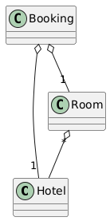

# Table Module

A Table Module represents a single instance responsible for managing the business logic associated with all rows within a specific database `table` or `view`.

One-to-one mapping principle is adhered, where `each database table` is directly linked to a corresponding `class` within the domain logic layer. Clients interact with only a `single` instance of this class for each table.

Comparing to `Transaction Script`, the `Table Module` pattern is more object-oriented and utilizes classes to represent tables within the database.Generally with `Table Module` pattern it is easier and faster to organized and create new code.

However, the `Table Module` pattern remains a `data-centric` approach and lacks a clear separation between `business logic` and `data access logic`.

The `Table Module` pattern is well-suited for small applications with `simple business logic` and a `limited number of tables`.

Using this pattern, it becomes challenging to test the business logic effectively due to the tight coupling between business logic and data access logic.

`Managing database transactions` can be difficult because the `data access logic` is intertwined with the `business logic`.

To facilitate the management of `database transactions`, an additional layer – the `Service Layer` – can be introduced above the Domain Layer. And within the Service Layer, the `Unit of Work` pattern can be employed to effectively manage database transactions.

### Example

In this example, in the `PresentationLayer` has several methods to imitate real-world application.

The `CreateHotelWithRoomsAndBookings` method creates a hotel with two rooms and two bookings.

The `CancellAllBookigsInAllHotes` method cancels all bookings in all hotels.

In the `DomainLayer`, there are three classes - table modules: Hotel, Room, and Booking.

The Hotel class can create a hotel, get a hotel by id, get all hotels, save a hotel, and cancel all bookings in all hotels.

The Room class can create a room and save a room.

The Booking class can create a booking, save a booking, and remove all bookings by hotel id.

###### Domain Model schema
<hidden style="display:none">
@startuml
class Hotel
class Room
class Booking

Booking o-- "1" Room
Booking o-- "1" Hotel
Room "*" o-- Hotel
@enduml
</hidden>




###### DB schema
<hidden style="display:none">
@startuml
@startuml
object hotel {
   Id 
   Name  
}

object room {
   Id 
   HotelId 
   RoomNumber
   Capacity 
}

object booking {
   Id 
   HotelId 
   RoomId 
   Duration 
   Date 
}

hotel::Id <-- room::HotelId  
booking::RoomId --> room::Id
booking::HotelId --> hotel::Id

@enduml
</hidden>


```csharp

using DataAccessLayer;
using DomainLayer;
using Microsoft.Data.Sqlite;
using Microsoft.EntityFrameworkCore;
using PresentationLayer;

await new MainController().Main();

namespace PresentationLayer
{
    class MainController
    {

        public async Task Main()
        {
            using var dbContext = new AppDbContext();
            var isCreated = await dbContext.Database.EnsureCreatedAsync();
            var script = dbContext.Database.GenerateCreateScript();

            await CreateHotelWithRoomsAndBookings();

            await CancellAllBookigsInAllHotes();
        }

        private async Task CreateHotelWithRoomsAndBookings()
        {
            using var dbContext = new AppDbContext();
            var hotel = await Hotel.CreateHotel(dbContext, "Hotel 1");
            var room1 = await Room.CreateRoom(dbContext, hotel.Id, 101, 2);
            var room2 = await Room.CreateRoom(dbContext, hotel.Id, 102, 3);
            var booking1 = await Booking.CreateBooking(dbContext, room1.Id, hotel.Id, DateTime.Now.AddDays(1), 2);
            var booking2 = await Booking.CreateBooking(dbContext, room2.Id, hotel.Id, DateTime.Now.AddDays(2), 3);
        }

        private async Task CancellAllBookigsInAllHotes()
        {
            using var dbContext = new AppDbContext();

            await new Hotel(dbContext).CancellAllBookingsInAllHotels();
        }
    }
}


namespace DomainLayer
{
    public class Hotel(AppDbContext dbContext)
    {
        private Hotel(AppDbContext dbContext, string name) : this(dbContext)
        {
            this.Id = Guid.NewGuid();
            this.Name = name;
        }

        public static async Task<Hotel> CreateHotel(AppDbContext dbContext, string name)
        {
            var hotel = new Hotel(dbContext, name);

            await hotel.Save();

            return hotel;
        }

        public Guid Id { get; set; }

        public string Name { get; set; }

        public ValueTask<Hotel?> TryGetById(Guid id) => dbContext.Hotels.FindAsync(id);

        public async Task<IEnumerable<Hotel>> GetAllHotels() => await dbContext.Hotels.ToListAsync();

        public async Task Save()
        {
            await dbContext.Hotels.AddAsync(this);

            await dbContext.SaveChangesAsync();
        }

        public async Task CancellAllBookingsInAllHotels()
        {
            var hotels = await GetAllHotels();

            foreach (var hotel in hotels)
            {
                await new Booking(dbContext).RemoveAllBookingsByHotelId(hotel.Id);
            }
        }
    }

    public class Room(AppDbContext dbContext)
    {
        private Room(AppDbContext dbContext, Guid hotelId, int roomNumber, int capacity) : this(dbContext)
        {
            this.Id = Guid.NewGuid();
            this.HotelId = hotelId;
            this.RoomNumber = roomNumber;
            this.Capacity = capacity;
        }

        public static async Task<Room> CreateRoom(AppDbContext dbContext, Guid hotelId, int roomNumber, int capacity)
        {
            var room = new Room(dbContext, hotelId, roomNumber, capacity);

            await room.Save();

            return room;
        }

        public Guid Id { get; set; }

        public Guid HotelId { get; set; }

        public int RoomNumber { get; set; }

        public int Capacity { get; set; }

        public async Task Save()
        {
            await dbContext.Rooms.AddAsync(this);

            await dbContext.SaveChangesAsync();
        }
    }

    public class Booking(AppDbContext dbContext)
    {
        private Booking(AppDbContext dbContext, Guid roomId, Guid hotelId, DateTime date, int duration) : this(dbContext)
        {
            // Execute business logic here
            if (duration < 1)
            {
                throw new ArgumentException("Duration must be at least 1 day");
            }

            if (date < DateTime.Now)
            {
                throw new ArgumentException("Date must be in the future");
            }

            this.Id = Guid.NewGuid();
            this.RoomId = roomId;
            this.HotelId = hotelId;
            this.Date = date;
            this.Duration = duration;
        }

        public static async Task<Booking> CreateBooking(AppDbContext dbContext, Guid roomId, Guid hotelId, DateTime date, int duration)
        {
            var booking = new Booking(dbContext, roomId, hotelId, date, duration);

            await booking.Save();

            return booking;
        }

        public Guid Id { get; set; }

        public Guid RoomId { get; set; }

        public Guid HotelId { get; set; }

        public DateTime Date { get; set; }

        public int Duration { get; set; }

        public async Task Save()
        {
            await dbContext.Bookings.AddAsync(this);

            await dbContext.SaveChangesAsync();
        }

        public async Task RemoveAllBookingsByHotelId(Guid hotelId)
        {
            var bookings = await dbContext.Bookings.Where(b => b.HotelId == hotelId).ToListAsync();

            dbContext.Bookings.RemoveRange(bookings);

            await dbContext.SaveChangesAsync();
        }
    }
}

namespace DataAccessLayer
{
    public class AppDbContext : DbContext
    {
        public DbSet<Hotel> Hotels { get; set; }

        public DbSet<Booking> Bookings { get; set; }

        public DbSet<Room> Rooms { get; set; }

        protected override void OnConfiguring(DbContextOptionsBuilder optionsBuilder)
        {
            var keepAliveConnection = new SqliteConnection("DataSource=myshareddb;mode=memory;cache=shared");
            keepAliveConnection.Open();

            optionsBuilder.UseSqlite(keepAliveConnection);
        }

        protected override void OnModelCreating(ModelBuilder modelBuilder)
        {
            modelBuilder.Entity<Hotel>()
                .ToTable("hotel");

            modelBuilder.Entity<Room>()
                .ToTable("room");

            modelBuilder.Entity<Booking>()
                .ToTable("booking");
        }
    }
}

```
```sql
CREATE TABLE "booking" (
    "Id" TEXT NOT NULL CONSTRAINT "PK_booking" PRIMARY KEY,
    "RoomId" TEXT NOT NULL,
    "HotelId" TEXT NOT NULL,
    "Date" TEXT NOT NULL,
    "Duration" INTEGER NOT NULL
);

CREATE TABLE "hotel" (
    "Id" TEXT NOT NULL CONSTRAINT "PK_hotel" PRIMARY KEY,
    "Name" TEXT NOT NULL
);

CREATE TABLE "room" (
    "Id" TEXT NOT NULL CONSTRAINT "PK_room" PRIMARY KEY,
    "HotelId" TEXT NOT NULL,
    "RoomNumber" INTEGER NOT NULL,
    "Capacity" INTEGER NOT NULL
);

```

##### Pros Table Model pattern

**Simplicity:**
- Relatively straightforward to implement, especially for applications with a strong focus on database operations.

**Database-Centric:** 
- Leverages the strengths of relational databases and their query languages (e.g., SQL).

##### Cons Table Model pattern

**Limited Object-Oriented Features**
- Doesn't fully embrace object-oriented principles like `inheritance` and `polymorphism`.
- Can lead to `procedural code` and limited flexibility.

**Tight Coupling to Database**
- Changes in the database schema can significantly impact the table modules.
- Difficult to adapt to changes in data storage mechanisms.

**Limited Reusability:**
- Business logic is often tightly coupled to specific database tables.
- Reusing logic across different use cases can be challenging.

**Scalability Issues:**
- As the application grows and complexity increases, managing numerous table modules can become cumbersome.
