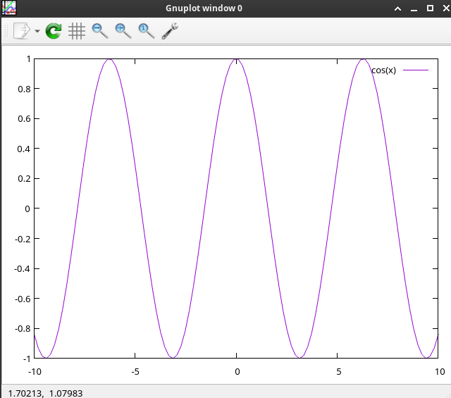

# `gnuplot` C# example of using

```csharp

using System.Diagnostics;
using System.Threading.Channels;


var channel = Channel.CreateBounded<string>(100);

Task.Run(async () =>
{
    // Draw two sets of lines
    await channel.Writer.WriteAsync("plot '-' with lines, "
                                            + "'-' with lines");

    await channel.Writer.WriteAsync("1 1");
    await channel.Writer.WriteAsync("2 2");
    await channel.Writer.WriteAsync("2 0");
    await channel.Writer.WriteAsync("e");

    await channel.Writer.WriteAsync("0 2");
    await channel.Writer.WriteAsync("2.5 2.5");
    await channel.Writer.WriteAsync("0 3.5");
    await channel.Writer.WriteAsync("e");

    await Task.Delay(10_000);

    // Draw cosine function instead of two sets of lines after 10 seconds
    await channel.Writer.WriteAsync("plot cos(x)");


    // Close the gnuplot process with a dialog
    //
    //channel.Writer.Complete();
});

await GnuPlotExecutor.ExecuteCommandsAsync(channel.Reader);


Console.WriteLine("Hello, World!");


class GnuPlotExecutor{
    private const string GnuPlotExecutable = "gnuplot";

    public static async Task ExecuteCommandsAsync(ChannelReader<string> commands, CancellationToken cancellationToken = default)
    {
        ProcessStartInfo startInfo = new()
        {
            FileName = GnuPlotExecutable,
            Arguments = "-",
            RedirectStandardInput = true,
            RedirectStandardOutput = false,
            RedirectStandardError = false,
            UseShellExecute = false,
            CreateNoWindow = true
        };

        using Process process = new() { StartInfo = startInfo };

        process.Start();

        using var input = process.StandardInput;
        input.AutoFlush = false;

        while (await commands.WaitToReadAsync(cancellationToken).ConfigureAwait(false))
        {
            while (commands.TryRead(out var command))
            {
                cancellationToken.ThrowIfCancellationRequested();
                var commandString = command.AsMemory();

                await input.WriteLineAsync(commandString, cancellationToken).ConfigureAwait(false);
                await input.FlushAsync(cancellationToken).ConfigureAwait(false);
            }
        }

        input.Close();

        await process.WaitForExitAsync(cancellationToken).ConfigureAwait(false); 
    }
}


```

