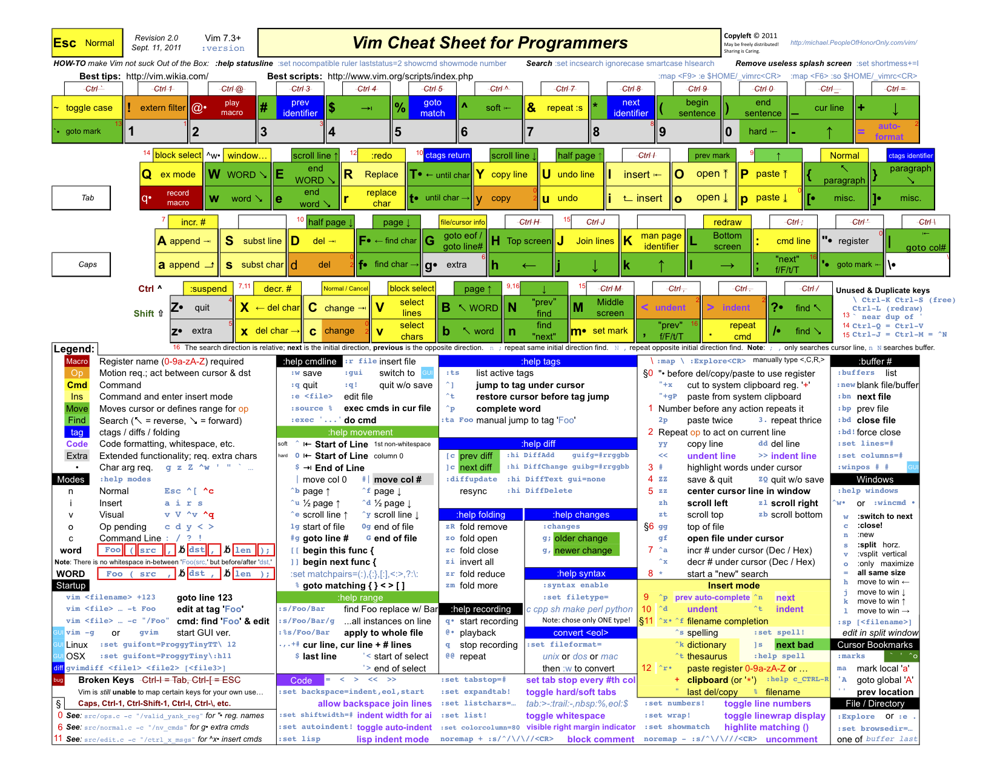

# vim hotkeys



(taken from: https://michael.peopleofhonoronly.com/vim/)

```vim
Basics
:e filename	Open filename for edition
:w	Save file
:q	Exit Vim
:w!	Write file and quit
Search
/word	Search word from top to bottom
?word	Search word from bottom to top
/jo[ha]n	Search john or joan
/\< the	Search the, theatre or then
/the\>	Search the or breathe
/\< the\>	Search the
/\< �.\>	Search all words of 4 letters
/\/	Search fred but not alfred or frederick
/fred\|joe	Search fred or joe
/\<\d\d\d\d\>	Search exactly 4 digits
/^\n\{3}	Find 3 empty lines
:bufdo /searchstr/	Search in all open files
Replace
:%s/old/new/g	Replace all occurences of old by new in file
:%s/old/new/gw	Replace all occurences with confirmation
:2,35s/old/new/g	Replace all occurences between lines 2 and 35
:5,$s/old/new/g	Replace all occurences from line 5 to EOF
:%s/^/hello/g	Replace the begining of each line by hello
:%s/$/Harry/g	Replace the end of each line by Harry
:%s/onward/forward/gi	Replace onward by forward, case unsensitive
:%s/ *$//g	Delete all white spaces
:g/string/d	Delete all lines containing string
:v/string/d	Delete all lines containing which didn�t contain string
:s/Bill/Steve/	Replace the first occurence of Bill by Steve in current line
:s/Bill/Steve/g	Replace Bill by Steve in current line
:%s/Bill/Steve/g	Replace Bill by Steve in all the file
:%s/\r//g	Delete DOS carriage returns (^M)
:%s/\r/\r/g	Transform DOS carriage returns in returns
:%s#<[^>]\+>##g	Delete HTML tags but keeps text
:%s/^\(.*\)\n\1$/\1/	Delete lines which appears twice
Ctrl+a	Increment number under the cursor
Ctrl+x	Decrement number under cursor
ggVGg?	Change text to Rot13
Case
Vu	Lowercase line
VU	Uppercase line
g~~	Invert case
vEU	Switch word to uppercase
vE~	Modify word case
ggguG	Set all text to lowercase
:set ignorecase	Ignore case in searches
:set smartcase	Ignore case in searches excepted if an uppercase letter is used
:%s/\<./\u&/g	Sets first letter of each word to uppercase
:%s/\<./\l&/g	Sets first letter of each word to lowercase
:%s/.*/\u&	Sets first letter of each line to uppercase
:%s/.*/\l&	Sets first letter of each line to lowercase
Read/Write files
:1,10 w outfile	Saves lines 1 to 10 in outfile
:1,10 w >> outfile	Appends lines 1 to 10 to outfile
:r infile	Insert the content of infile
:23r infile	Insert the content of infile under line 23
File explorer
:e .	Open integrated file explorer
:Sex	Split window and open integrated file explorer
:browse e	Graphical file explorer
:ls	List buffers
:cd ..	Move to parent directory
:args	List files
:args *.php	Open file list
:grep expression *.php	Returns a list of .php files contening expression
gf	Open file name under cursor
Interact with Unix
:!pwd	Execute the pwd unix command, then returns to Vi
!!pwd	Execute the pwd unix command and insert output in file
:sh	Temporary returns to Unix
$exit	Retourns to Vi
Alignment
:%!fmt	Align all lines
!}fmt	Align all lines at the current position
5!!fmt	Align the next 5 lines
Tabs
:tabnew	Creates a new tab
gt	Show next tab
:tabfirst	Show first tab
:tablast	Show last tab
:tabm n(position)	Rearrange tabs
:tabdo %s/foo/bar/g	Execute a command in all tabs
:tab ball	Puts all open files in tabs
Window spliting
:e filename	Edit filename in current window
:split filename	Split the window and open filename
ctrl-w up arrow	Puts cursor in top window
ctrl-w ctrl-w	Puts cursor in next window
ctrl-w_	Maximise current window
ctrl-w=	Gives the same size to all windows
10 ctrl-w+	Add 10 lines to current window
:vsplit file	Split window vertically
:sview file	Same as :split in readonly mode
:hide	Close current window
:�nly	Close all windows, excepted current
:b 2	Open #2 in this window
Auto-completion
Ctrl+n Ctrl+p (in insert mode)	Complete word
Ctrl+x Ctrl+l	Complete line
:set dictionary=dict	Define dict as a dictionnary
Ctrl+x Ctrl+k	Complete with dictionnary
Marks
mk	Marks current position as k
?k	Moves cursor to mark k
d�k	Delete all until mark k
Abbreviations
:ab mail mail@provider.org	Define mail as abbreviation of mail@provider.org
Text indent
:set autoindent	Turn on auto-indent
:set smartindent	Turn on intelligent auto-indent
:set shiftwidth=4	Defines 4 spaces as indent size
ctrl-t, ctrl-d	Indent/un-indent in insert mode
>>	Indent
<<	Un-indent
Syntax highlighting
:syntax on	Turn on syntax highlighting
:syntax off	Turn off syntax highlighting
:set syntax=perl	Force syntax highlighting
```