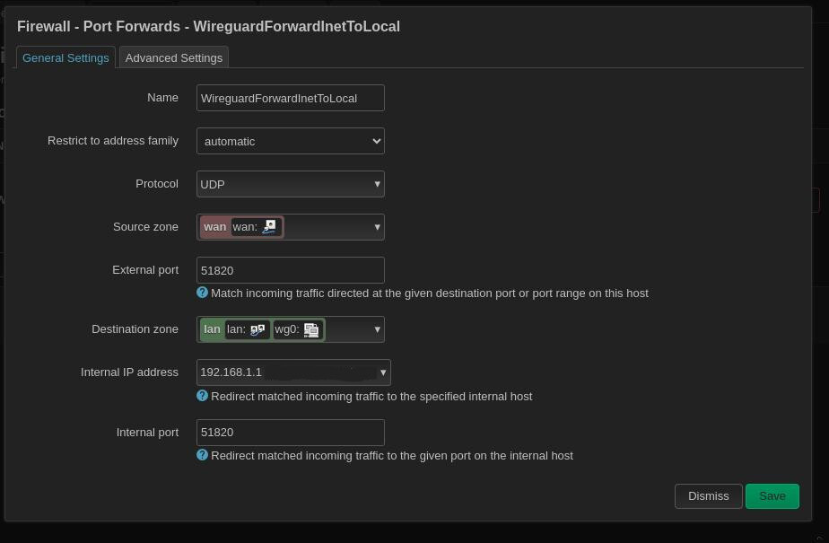

# `OpenWrt` configure `wireguard`

Create VPN server with WireGuard
https://www.youtube.com/watch?v=6NIJcsJsRaM


1. Install packages:

wireguard-tools
luci-proto-wireguard
kmod-wireguard  (should be installed automatically)

2. ssh to router
```sh
$ mkdir /etc/wireguard
$ umask ..
```
3. Generate public & private keys

4. Network-> interfaces
Add new interface wg0

5. Add peers

6. Configure firewall 
   Network->Firewall 
   Add PortForwarding

7. reboot

8. Check Status->Wireguard tab

---
1. Configure client

2. Generate public & private keys

3. create `wg0.conf` file

[!code-sh[](wg0.conf)]


4. 
```sh
systemctl enable wg-quick@wg0
```

To stop/start:
```sh
systemctl stop wg-quick@wg0
systemctl start wg-quick@wg0
```

---
Interfaces


Firewall settings


General settings


Network port forwarding


Peers configuration
