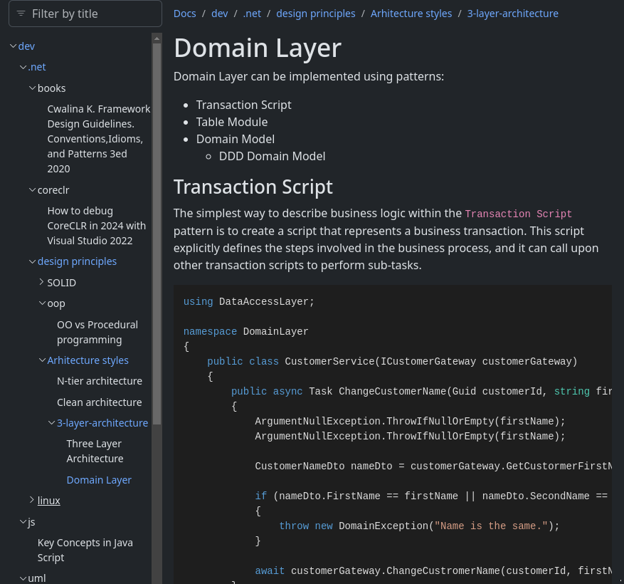

<form name="f">
    <input name="ft" style="border:none;outline:none;font-family:monospace;font-size:16px;background-color:transparent;width:100%" size="48" readonly="readonly">  
</form>

 

Welcome to my personal page. 

Please, check [about](pages/about.md). 

After reading a book or acquiring useful information, I like to make notes.

Some of them are shared on this website. Please, check `Docs`.

