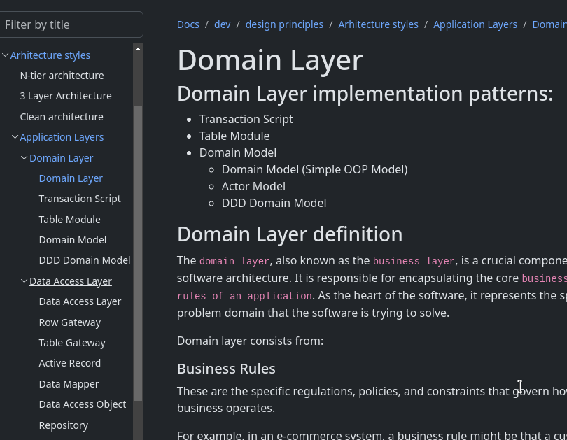

<form name="f">
    <input name="ft" style="border:none;outline:none;font-family:monospace;font-size:16px;background-color:transparent;width:100%" size="48" readonly="readonly">  
</form>

 

Welcome to my personal page. 

Useful notes and articles located in the `Docs` section.

[Clean arhitecture](docs/dev/design-principles/architecture-styles/clean-arhitecture/clean-arhitecture.html#code-example)

[Domain Layer](docs/dev/design-principles/application-layers/domain-layer/domain-layer.html)

