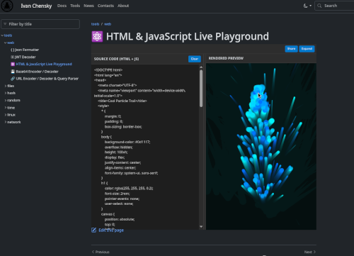
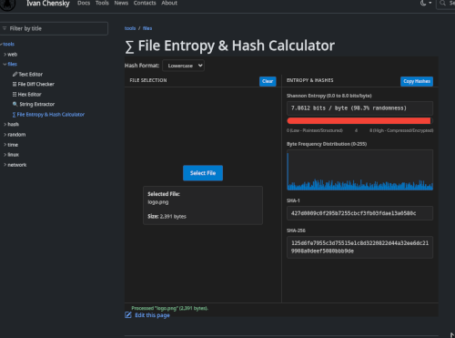

Explore the newest additions to the platform. Here are the most recent updates, published articles, and newly integrated tools.

1. **[Memoization vs Tabulation: LCS example](/docs/dev/algorithms/essential/data-structures/graph/memoization-vs-tabulation/memoization-vs-tabulation.html)** - A note about memoization and tabulation techniques for solving the Longest Common Subsequence problem using dynamic programming.

2. **[HTML & JavaScript Live Playground](/tools/web/html-js-live-playground.html#code=H4sIAAAAAAAAA41XbW_bNhD-3l9x8zZEbizLShB0sK0AbdpiBVosaDJsRVGgtHSyuFCkRp5sq0X--0BKftFLiumDLfOee-Hdczx6-dPrP27uP92-gYxycf1sab9AMLmORihHdgFZcv0MAGCZIzGIM6YNUjT68_6t_9voVCRZjtFow3FbKE0jiJUklBSNtjyhLEpww2P03Y8JcMmJM-GbmAmMwulsb4o4Cby-UUrALdPEY4FwrxkXy6AW1TBD1f7dPs_h--HdPjnTay7nMFu0lguWJFyue-srtfMN_-ZEK6UT1P5K7Y6Yx2dHZFJ1fK1Y_LDWqpSJHyuh9Bx-niVhGL5o-1Ab1KlQ2zlkPElQtqUZ8nVGcwhns03WFiXcFIJVc0gF7tqif0pDPK38JtVziFES6jaICb6WPifMzTAgVZL8lOVcVHMwlSHM_ZJPwDBpfIOap0OZyMJOHprN6_WKeRdXVxM4fsymF-MBn4Z_wzlcaMw7ZVLcRunjBiWZOUglsY0oDWrfoMCYuuJjhDGTG2Y6URbKcOJKzoGtjBIldSyTKnr0EJhSb9ER2RXs1ydL-Ws3rGXQEHcZ1J21tIS6flYLs_D6g9ogVKrUkKvSIDBHrGWQhQ3xm03xJBoVTX_cuKXR9TKohXtzJta8oGOTxEoa2mclgkTFZY6SpmukNwLt66vqXeKdte2enVSusUA7iBo7VvnGsm9H3tlFYsEHdBDAR7Q13vskBSkXAihD2HKZqO0Bm5YytmUB7TRq1964S7Hap0s9RI2NKZcS9V92bTGEruvRgf_uFodY0w7giGi0WZK8sbR8zw2hRO2d1Qpnk5bmaR7qrO2zal5qzSqI4POXbmKzEiGC2cJm7hUzWLcUZEo9AE8tLWDLJNk8akWMGoABwQh1K_H3msUPDYdytXHV7XirhVEnxbs5lDLBlEtMJi1JdSI55u1kn09myHmyUZxNDoX2XHN3C-yQU0svJ552zrtaXB3EVVvc-hEEcFewrYS8FMQLgccKQIHaZQVSpYGB5nGGGjBNMaaWESv3BBLwujAclnC5AH5-3o0c3Hg5LfG0KE3mSdweBpk37pyCR9Y9dhrnMPtWosRC89PqCWbMEdA9hKUhXcakdK977EMZNy6_TaYXw4jqgKj6CNvXTCYqB9fcK6QtooQLYDKB8AoKvkNhhg07jQg-MMqm2hnxxvAcwks4h4sFDPm6KxAT2DDN2coWz4s1MkIDDIxwrV0WW6YTSDRPafyEX2vk7wHPl-BDOL16Ig9O7dOAmm_1ZkN6QQA3FZOBLRykJZWaG-Jx08smzjC3px9lUJsDJoqMDbuvdSL46obqbAK_fHeBpEIp7fWSeDWDcwhnV-PHZu428BPMbHoF5_bzcfy1y8X2hC0SRvgjDp1Hp6l9kkgt2KfBfN1lmsuHQ_u4qxIQz7EH5il4Rx5du4vFCbH8CGbT8If7SjTbDu4qpt3UTqc7O6AhOilAP2aLXeGay1tGmTceBjAd17HuJk0uJsdQJzCb1KS6fQfPoXs9Og2oa__k0GgdGS8lz5mboe-VKvqTlTl5v6RBAK812x7aSVRAmklTMI2STq63oDEmJtcC7QQSyDZokVxwuYaCUdbu-W5CzxyJw8sJhC8mcHFpr4Xh-GwxqPQRY7KEn01aQ3_SHuqnhyY8cVx3DmWBck3Z_zzCP_Mv030j9AvUx9bk6gQF-6uQmzjEZQVcbrjhq9ZMIgU545IYl3Y-pUrnTMbDLdD37Oi_jOqG6G-rH-7UFILH6PEJhAN7c558vy94fIKL4K5O_5Zo6EDEt5rl6DW8Gy-GeHsg5WJ_P24urcugvhkvg_qv6X9EG7xfqw4AAA&expand=1)** - A live coding environment for experimenting with HTML and JavaScript, complete with real-time preview and sharing capabilities.

3. **[Reverse thinking: How to solve problems by thinking backwards](/docs/dev/algorithms/problem-solving-models/reverse-thinking.html)** - A practical guide to using reverse thinking for problem-solving, with examples and exercises.

4. **[Z-Algorithm: Efficient String Searching](/docs/dev/algorithms/essential/string-searching/Z-algorithm.html)** - An in-depth look at the Z-Algorithm, a powerful technique for string searching and pattern matching.

5. **[Hex Editor: A Tool for Viewing and Editing Binary Files](/tools/files/hex-editor.html)** - A web-based hex editor for inspecting and modifying binary files, with features like search, edit, and export.

6. **[String Extractor: Extract Substrings from Text](/tools/files/string-extractor.html)** - A utility for extracting specific substrings from larger text blocks, useful for data processing and analysis.

7. **[File entropy calculator: Measure the randomness of files](/tools/files/file-entropy.html)** - A tool to calculate the entropy of files, helping to assess their randomness and potential security implications.

8. **[Permutation vs Combination](/docs/dev/math/combinatorics/permutation-vs-combination.html)** - Note on the differences between permutations and combinations. 

9. **[Dijkstra's Algorithm: Shortest Path in Graphs](/docs/dev/algorithms/essential/data-structures/graph/dijkstra-algorithm/dijkstra-algorithm.html)** - A guide to Dijkstra's algorithm, including its implementation in finding the shortest path in graphs.

10. **[Backtracking Algorithm: Solving Problems with Recursion](/docs/dev/algorithms/essential/backtracking/backtracking.html)** - An exploration of the backtracking algorithm, a recursive approach to solving constraint satisfaction problems.

11. **[About the Author](/pages/about.html)** - Learn more about the author, their experience, and their approach to software development and problem-solving.